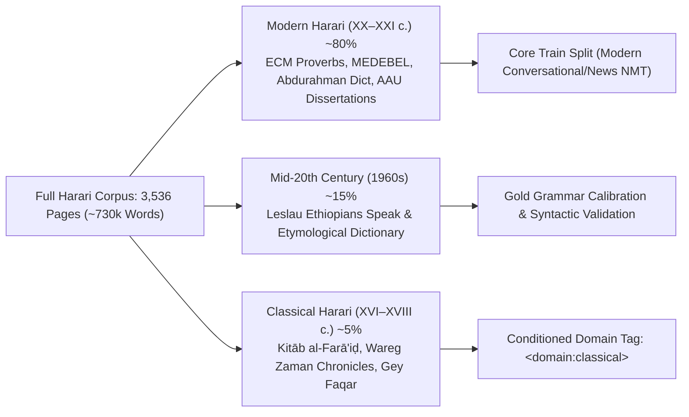
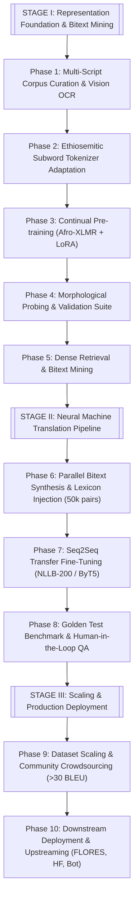
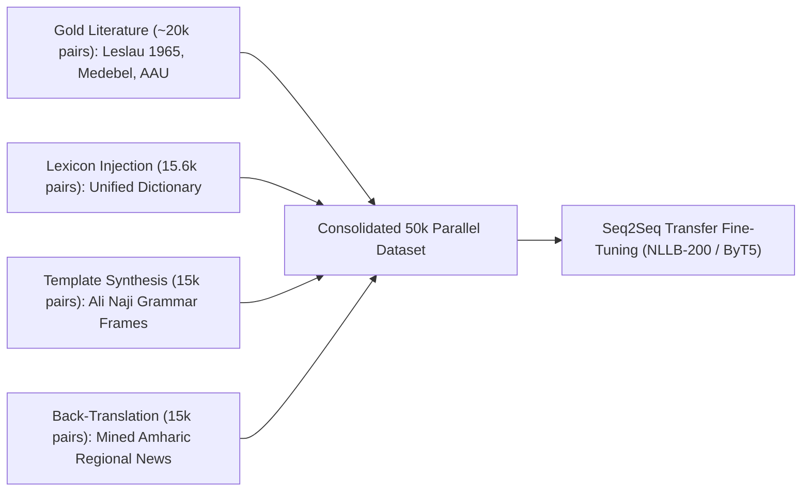
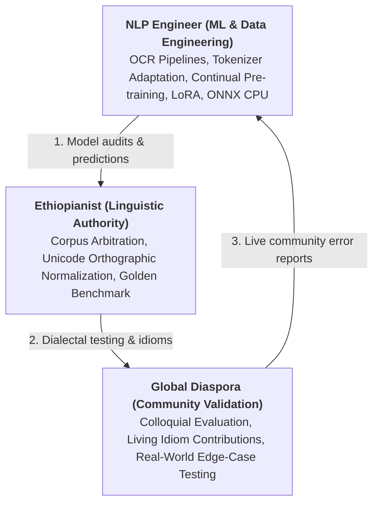

# Harari NMT: Representation Learning, Bitext Mining & Neural Machine Translation for Gey Sinan (ሐረሪ)

> **Languages:** [English](README.md) • [Русский](README_RU.md) • [አማርኛ](README_AM.md)  
> **Project Status:** Active Corpus Construction & Phase 1 OCR Digitization  
> **Target Language:** Harari (*Gey Sinan* / ጌይ ሲናን / ሐረሪ) · ISO 639-3: `har` · Glottolog: `hara1271` · WALS: `hrr`  
> **Linguistic Family:** Afroasiatic → Semitic → South Ethiosemitic (Harar Jugol, Ethiopia & Global Diaspora)

---

## 1. Executive Summary & Research Motivation

The **Harari language** (*Gey Sinan* / ጌይ ሲናን, literally "Language of the City") is a South Ethiosemitic language historically rooted in the ancient walled city of **Harar Jugol** in eastern Ethiopia, with established diaspora communities across North America, Europe, Australia, and the Middle East.

### 1.1. Historical Depth & Cultural Weight: A Multicentury Written Tradition
Harari holds an extraordinary position in African historiography and Semitic linguistics:
* **Islamic Urban Stronghold & UNESCO World Heritage:** Enclosed by reinforced 16th-century stone ramparts constructed under Emir Nur ibn Mujahid, the ancient fortified city of Harar Jugol (a UNESCO World Heritage site) stood for centuries as a pivotal religious, educational, and Sufi center across the Horn of Africa (housing 82 historical mosques and 102 shrines). This self-contained urban micro-environment served as the sociolinguistic sanctuary that enabled *Gey Sinan* to preserve its autonomy, institutionalize municipal governance, and cultivate an indigenous written tradition.
* **Capital of the Adal Sultanate & Sovereign Emirate (16th–19th c.):** Beginning in 1520, Harar served as the capital of the Adal Sultanate under Imam Ahmad ibn Ibrahim al-Ghazi (Ahmad Gragn), subsequently evolving into the sovereign Emirate of Harar. For over 350 years, *Gey Sinan* functioned as the state language of royal administration, trade, Islamic jurisprudence, and Sufi theology until its incorporation into the Ethiopian Empire in 1887 (Battle of Chelenqo). The Emirate minted its own currency (*mahallaq*), anchoring major trade routes connecting Red Sea ports with the African interior.
* **Rare Pre-Colonial Sub-Saharan Literary Tradition:** While the vast majority of sub-Saharan African languages were first committed to writing in the late 19th or 20th centuries, Harari boasts a **continuous written manuscript tradition dating back to the 16th–17th centuries** utilizing modified Arabic script (**Ajami**). The historical Harari corpus includes:
  * Classical Islamic jurisprudence treaties (*Kitāb al-Farā'iḍ*);
  * Historical chronicles and epics (the vernacular translation of *Futūḥ al-Ḥabasha* — *Wareg Zaman*);
  * Extensive Sufi devotional hymns, dhikr cycles, and ceremonial poetry (*Gey Faqar*);
  * Municipal legal archives, marriage deeds, and trade contracts.
* **The Unique "Semitic Island" Phenomenon:** Typologically, Harari is an isolated South Ethiosemitic language island, having developed over centuries completely detached from Northern Semitic languages (Ge'ez, Amharic, Tigrinya) and encircled entirely by Cushitic language communities (Afaan Oromo and Somali). This geographic containment preserved archaic South Ethiosemitic morphological structures while fostering a rich layer of contact phenomena.

### 1.2. Demographic Profile & Sociolinguistic Status
The sociolinguistic status of Harari is characterized by a stark disparity between gross regional population statistics, the worldwide diaspora, and the actual number of active speakers:
* **Gross Regional Population:** ~270,000 residents in the Harari People's National Regional State.
* **Regional Ethnic Distribution:** Ethnic Hararis represent a **demographic minority (~8.6%, ~20,000–25,000 people)** within their own titular federal state, where Afaan Oromo (~56%) and Amharic (~23%) form the regional majorities.
* **Native (L1) Speakers:** The official 2007 Ethiopian Population and Housing Census recorded **only 25,810 native L1 speakers** nationwide.
* **Secondary (L2) Speakers:** ~8,300 documented L2 speakers within Ethiopia.
* **Total Global Speakers (L1 + L2 + Active Diaspora):** Approximately **35,000–45,000 individuals**.
* **Worldwide Ethnic Population:** Estimated between **70,000 and 200,000 people** (including descendants of historical emigration waves and intermarriages in Toronto, Melbourne, Dallas, and Jeddah).
* **The Language Shift Crisis:** Younger diaspora generations (2nd and 3rd generation) experience rapid generational language loss, transitioning primarily to English. Within Harar itself, youth increasingly adopt Amharic and Oromo for commerce and daily socialization.

This disparity—an ethnic community of up to 200,000 people supported by fewer than 35,000 fluent native speakers—led UNESCO to classify Harari as an **endangered** language.

### 1.3. The Machine Translation Void
Despite its rich medieval literary heritage and status as an official state language, Harari is completely absent from modern NLP ecosystems:
* **Google Translate:** 0% support (Harari is unindexed).
* **Meta NLLB-200:** Excluded (while Ethiopian sister languages Amharic `amh_Ethi`, Tigrinya `tir_Ethi`, and Oromo `gaz_Latn` are supported, Harari has no checkpoint).
* **Open Benchmarks:** No public, reproducible parallel datasets, pre-trained weights, or evaluation benchmarks exist for Harari in open-source NLP registries.

This project delivers the **first open, reproducible end-to-end NLP infrastructure and Neural Machine Translation (NMT) system for Harari**, pairing continual pre-training of multilingual encoders with bitext mining and transfer-learned Seq2Seq models.

---

## 2. Linguistic Characteristics & Morpho-Syntactic Profile

Harari exhibits linguistic traits typical of South Ethiosemitic languages, presenting unique challenges for standard tokenization and sequence-to-sequence modeling:

| Morpho-Syntactic Feature | Linguistic Realization in Harari | NLP & Engineering Challenge |
| :--- | :--- | :--- |
| **Root-and-Pattern Morphology** | Triconsonantal roots ($\sqrt{C_1 C_2 C_3}$) modulated across 12 verb classes | Severe lexical dispersion, high OOV rate for standard subword tokenizers |
| **Agglutinative Clitic Stacking** | Prefixes (Rel, Prep) + Verb Stem + Tense + Object Pronoun Suffixes | Single orthographic token encodes full propositional clause |
| **Relative Verbal Envelope** | Discontinuous circumclitic framing: `zi- ... -zāl` | Requires robust long-range self-attention resolution in encoder |
| **Head-Final SOV Typology** | Strict verb-final order, postpositions, modifiers precede noun heads | Large reordering penalty and structural divergence when translating to SVO |
| **Multi-Script Orthography** | Ethiopic Fidel, Latin/IPA (Leslau/AAU), Arabic Ajami | Unicode NFC normalization and homophone-merging mandatory |
| **Urban Trilingual Diglossia** | Dynamic conversational code-switching with Amharic and Afaan Oromo | Strict language-ID and perplexity filtering to prevent training set corruption |


### 2.1. Non-Concatenative Root-and-Pattern Morphology
Like classical Semitic languages (Arabic, Ge'ez), Harari verbal and nominal systems are governed by discontinuous consonantal roots (primarily triconsonantal $\sqrt{C_1 C_2 C_3}$) modulated by internal vocalic apophony (ablaut) and derivational templates. Harari grammars categorize verbs into **12 distinct derivational and conjugational classes** (Classes A, B, C, and their frequentative, reciprocal, and causative expansions). A single root yields dozens of morphologically distinct surface forms, creating high lexical dispersion and severe Out-Of-Vocabulary (OOV) challenges for standard subword tokenizers.

### 2.2. Agglutinative Verbal Framing & Clitic Stacking
Unlike its northern Semitic relatives, Harari heavily incorporates agglutinative clitic stacking onto verbal stems. A single orthographic word frequently encodes an entire clause:
$$\text{Relative Marker} + \text{Prepositional Clitic} + \text{Subject Prefix} + \text{Verb Stem} + \text{Tense/Aspect Clitic} + \text{Object Pronoun Clitic}$$
* *Example:* `zit-habarkā-ñ` (ዚትሐበርካኝ)
  * Breakdown: `zi-` (relative pronoun *that which*) + `t-` (passive/reflexive morpheme) + `habar` (root stem *ask/inquire*) + `-kā` (2nd person masculine subject agreement) + `-ñ` (1st person singular object clitic *me*).
  * Translation: *"That which you asked me"*.

### 2.3. The Relative Verbal Envelope (`zi-` ... `-zāl`)
Harari employs a discontinuous circumclitic envelope for relative imperfective clauses:
* **Past/Perfective Relative:** Formed simply with the prefix `zi-` (e.g., `zidiǧa` — *"he who came"*).
* **Present/Imperfective Relative:** Bound between `zi-` (or assimilated variants) and the auxiliary participle `-zāl` (e.g., `yidīǧzāl` — *"he who comes / is coming"*; plural `yidīǧzālu` — *"they who come"*).

### 2.4. Syntactic Typology: Head-Final SOV
* **Word Order:** Strictly **Subject – Object – Verb (SOV)**. Auxiliaries, copulas, and main verbs universally terminate clauses.
* **Adpositional Structure:** Predominantly postpositional and circumpositional (e.g., `be-...-le` for instrumental/causal clauses, `le-...-gir` for conditional structures).
* **Noun Phrase:** Modifiers (adjectives, demonstratives, relative clauses, possessors) strictly precede the modified noun head.

### 2.5. Multi-Script Heterogeneity & Orthography
Harari literature spans three distinct writing systems:
1. **Ethiopic Fidel (ፊደል):** The contemporary standard adopted across schools and regional administration. Fully codified in the Unicode Standard (`U+1200–U+137F`), including the unique voiced velar nasal series **«ጘ»** (U+1318 `GGA` through U+131E `GGO`).
2. **Latin / IPA Transcription:** Employed in foundational 20th-century academic treatises (Wolf Leslau 1963, 1965) and modern Addis Ababa University linguistics dissertations, featuring phonetic diacritics (macrons for vowel length: `ā, ē, ī, ō, ū`; underdots for ejectives/pharyngeals: `ṭ, ṣ, ḥ`).
3. **Arabic Ajami (عجمي):** The historical script used from the 16th to early 20th century for religious treatises and legal manuscripts (*Kitāb al-Farā'iḍ*).
4. **Homophonic Neutralization Trap:** Like Amharic, Fidel script in Harari preserves historical Ge'ez homophones that produce phonetic ambiguity:
   * Consonants: `ሀ / ሐ / ኀ` (all pronounced /h/), `ሰ / ሠ` (/s/), `ጸ / ፀ` (/sʼ/).
   * Canonical Unicode Normalization (NFC) and homophone-merging heuristics are critical preprocessing requisites to avoid artificial vocabulary fragmentation.

### 2.6. Urban Code-Switching & Trilingual Diglossia
Field sociolinguistic recordings in Harar Jugol (documented in Nadia Ali's 2015 AAU dissertation) reveal intense conversational code-switching. In colloquial discourse, Harari matrix clauses seamlessly embed Amharic nouns, Oromo verbs, and Arabic religious formulas. An effective NMT system must possess robust domain-aware filtering to prevent regional colloquial borrowings from corrupting formal translations.

---

## 3. Diachronic Stratification of the Corpus

Training an NMT model on historical literature without domain conditioning causes severe stylistic degeneration (e.g., producing 16th-century legal archaic phrasing in response to contemporary conversational queries). Our corpus of 3,536 pages is categorized into three diachronic strata:



1. **Modern Harari (XX–XXI Century) — ~80% of Corpus:**
   * Everyday conversational vocabulary, administrative prose, and 20th-century idioms. Includes modern terminology (passports, aircraft, modern commerce). Represented by `ECM_proverbs_239p`, `MEDEBEL`, `Abdurahman-Harari-Amharic-Dectionery`, `BreakdownHarariGrammerEH`, and AAU dissertations.
2. **Mid-20th Century Harari (1950s–1960s) — ~15% of Corpus:**
   * High-register dialect recorded by Wolf Leslau during fieldwork in Harar. Impeccable phonetic precision and interlinear morphemic breakdowns. Serves as the golden standard for morphological calibration and syntactic validation.
3. **Classical / Old Harari (XVI–XVIII Century) — ~5% of Corpus:**
   * The epic prose of *Futūḥ al-Ḥabash* (translated as *Wareg Zaman*), Islamic jurisprudence (*Kitāb al-Farā'iḍ*), and sufi religious poetry (*Gey Faqar*). Features archaic verb inflections and extensive classical Arabic borrowings. Assigned explicit domain control prefixes (`<domain:classical>`) during training.

---

## 4. The Low-Resource NLP Paradox & Engineering Realities

Developing an NMT system for an endangered language requires confronting dirty execution realities that theoretical papers often gloss over:

### 4.1. Why Training From Scratch Fails
Training a standard Transformer encoder-decoder from random initialization requires tens of millions of parallel sentence pairs. On an extreme low-resource corpus (<50,000 sentences), a model trained from scratch fails to learn basic word order (BLEU < 8), succumbing to degenerative attention collapse and repetitive generation loops.

### 4.2. The Encoder-Only vs. Seq2Seq Architecture Trap
Fine-tuning an existing multilingual encoder such as **Afro-XLMR** or **EthioBERT** cannot directly solve translation:
* Encoders lack an autoregressive decoder to generate token sequences.
* Stitching two encoders via `EncoderDecoderModel` leaves cross-attention matrices initialized with random noise. Training those cross-attention weights requires millions of pairs—data that does not exist for Harari.
* **The Solution:** Leverage Seq2Seq backbones pre-trained on sister languages (**NLLB-200** or **ByT5**), using **Amharic (`amh_Ethi`) as the donor language**. Amharic shares the Fidel script, SOV clause topology, and cognate root structures.

### 4.3. The Tokenizer Fertility Rate Problem
Standard multilingual tokenizers (such as XLM-R's SentencePiece model) suffer from catastrophic **Fertility Rates** on Ethiopic scripts, splitting a single Fidel syllable into 2 to 4 byte fallback tokens. This inflates sequence length, degrades cross-attention resolution, and leads to memory exhaustion.
* **Remedy A:** SentencePiece vocabulary expansion initialized by averaging parent subword embeddings.
* **Remedy B:** Byte-level token-free architectures (**ByT5**), which operate directly on UTF-8 bytes and are naturally immune to out-of-vocabulary tokens and Fidel fragmentation.

### 4.4. Translation Direction Asymmetry
* **Harari $\rightarrow$ English / Amharic:** Considerably easier. The encoder extracts semantic features from Harari, while the decoder generates into high-resource targets whose language models are pre-trained on billions of tokens.
* **English / Amharic $\rightarrow$ Harari:** High error vulnerability. Generating valid Harari requires exact adherence to 12 verb classes, complex clitic agreement, and correct choice of homophonic Fidel graphemes.

### 4.5. The Legacy Font Encoding Trap
Books published in Ethiopia during the 1990s and 2000s utilized 8-bit pseudo-fonts (*GeezType, Visual Ge'ez*). These fonts map visual Ethiopic glyphs onto standard ASCII byte values. Extracting text via standard tools (`PyMuPDF.get_text()`) extracts underlying ASCII garbage (`›vÉ N[] KËT]<`).
* **Resolution:** Pure multimodal **Vision OCR** (`gemini-3.5-flash-lite`), treating pages strictly as visual images and generating verified Unicode UTF-8 output.

### 4.6. The Typewriter Artifact Challenge
Older works like Dr. Abdurahman's 1984 *Chuqtee Kitab* were composed on mechanical typewriters. Ink ribbon smudges blur visually similar characters (`ሊ` vs. `ሒ`, `ደ` vs. `ጀ`). Standard OCR models (Tesseract) achieve only ~70% accuracy. Large Multimodal Models (LMMs) with contextual language understanding resolve blurred characters using lexical context, reaching ~90% accuracy.

---

## 5. The 10-Phase End-to-End Master Pipeline

The comprehensive research roadmap is structured into three consecutive stages across 10 execution phases:



### Phase 1: Robust Vision OCR & Data Ingestion
* **Script:** `batch_ocr_books.py` (automated, checkpoint-safe, multithreaded).
* **Vision Model:** Primary `gemini-3.5-flash-lite`, fallback `gemini-3.1-flash-lite`.
* **Prompt Isolation:** Strict output boundary tags (`<TRANSCRIPTION>...</TRANSCRIPTION>`) to strip chain-of-thought internal reasoning.
* **Rate Limiting:** Thread-safe serialization enforcing ~14 RPM to operate reliably within the 15 RPM API tier.
* **Max Output Tokens:** Configured to 8,192 tokens per request to handle dense two-column dictionary pages.

### Phase 2: Tokenizer Modification & Vocab Expansion
* Benchmark baseline fertility rates across standard Afro-XLMR tokenizers on pure Harari text.
* Train an auxiliary Byte-level BPE model to identify top Harari morphemes.
* Inject Harari affixes (`-ዛል`, `-ዚዩ`, `-ሌ`, `-አች`) and frequent root lemmas into the SentencePiece vocabulary.
* Initialize new token embeddings by averaging constituent sub-token vectors to avoid representation shock.

### Phase 3: Continual Pre-training (Afro-XLMR + MLM + LoRA)
* **Base Model:** `Davlan/afro-xlmr-base`.
* **Objective:** Masked Language Modeling (MLM) with 15% dynamic token masking.
* **Parameter-Efficient Tuning:** LoRA adapters applied to multi-head attention projections ($W_q, W_k, W_v$) with $r=16, \alpha=32, \text{dropout}=0.05$.
* **Optimization:** AdamW with linear warmup and cosine learning rate decay in `bf16`/`fp16` mixed precision.

### Phase 4: Linguistic Probing & Diagnostic Suite
* **Perplexity Evaluation:** Tracking monotonic validation perplexity reduction on held-out Harari text.
* **Semantic Cluster Cohesion:** Verifying cosine similarity between culturally related lexical clusters (kinship, ritual, culinary) versus random baselines.
* **Linear Morphological Probes:** Diagnostic classifiers trained on frozen Mean-Pooled sentence embeddings to evaluate representation of:
  * Plurality inflections (`-አች`).
  * Possessive bindings (`-ዞ`, `-ዚዩ`).
  * Relative verbal frames (`ዚ-` ... `-ዛል`).

### Phase 5: Dense Retrieval & Bitext Mining (The Bootstrap Engine)
* Convert the adapted encoder into a bi-encoder using Mean Pooling and $L_2$ normalization (`sentence-transformers` compatible).
* FAISS vector indexing of historical dictionaries for fuzzy semantic search.
* **Bitext Mining:** Extract sentence embeddings from bilingual news media (Harari Mass Media Agency / Harari Government Communication) published in Harari and Amharic. Apply margin-based cosine scoring to harvest parallel sentence pairs.

### Phase 6: Parallel Bitext Construction (~50,000 Sentences)
To achieve the critical volume required for high-quality transfer NMT:



1. **Gold Parallel Bitext (~20,000 pairs):**
   * *Ethiopians Speak* (Leslau 1965): ~4,500 Harari ↔ English sentence pairs.
   * *Medebel*: ~2,500 Harari ↔ Amharic sentence pairs.
   * Ali Naji Grammar & AAU Dissertations: ~3,500 pairs.
   * Mined bilingual news & proverbs: ~10,000 pairs.
2. **Lexical Bi-text Injection (15,648 pairs):**
   * Feed `harari_unified_dictionary.csv` entries as pseudo-sentences (`"አደብ"` ➔ `"ስርዓት"`) to lock core vocabulary into the cross-attention weights.
3. **Template Syntactic Synthesis (~15,000 pairs):**
   * Slot dictionary lexemes into canonical syntactic frames from *Breakdown of Harari Grammar*.
4. **Back-Translation Augmented Corpus (~15,000 pairs):**
   * Translate clean Amharic regional news into Harari using a v0.1 draft model, filtering low-confidence outputs.

### Phase 7: Seq2Seq Fine-Tuning (NLLB-200 & ByT5)
* **Model Choices:**
  * **Primary:** `facebook/nllb-200-distilled-600M` (or 1.3B) using Amharic (`amh_Ethi`) as donor language.
  * **Alternative:** `google/byt5-base` (tokenizer-free byte-level model, eliminating Fidel out-of-vocabulary and token fragmentation issues).
* **Domain Tagging:** To prevent stylistic corruption from historical texts:
  * `<domain:modern>`: Modern spoken/written language (~80% of data, core train set).
  * `<domain:pedagogical>`: Leslau 1965 text (~15% of data, syntax calibration).
  * `<domain:classical>`: 16th–18th century religious chronicles (*Kitāb al-Farā'iḍ*, *Wareg Zaman*, *Gey Faqar*).
* **LoRA Setup:** Parameter-efficient adaptation of cross-attention and feed-forward layers on single GPU (RTX 4090 / Colab T4, ~2–4 hours).

### Phase 8: Golden Test Benchmark & Human-in-the-Loop QA
* Creation of an untainted **Golden Test Set (300–500 sentences)** spanning conversational, administrative, legal, and literary registers.
* **Linguistic Arbitration (Ethiopianist):**
  * Manual review of automated sentence alignment boundaries.
  * Orthographic audit of ambiguous Fidel characters (`ሀ/ሐ/ኀ`, `ሰ/ሠ`, `ጸ/ፀ`).
  * Qualitative human error taxonomy (tense/aspect confusion, transitivity errors, Amharic intrusion).

### Phase 9: Dataset Scaling & Community Crowdsourcing (v2.0)
* **Iterative Parallel Expansion:** Scaling the parallel sentence corpus through enhanced back-translation of regional news and targeted extraction of bilingual administrative records.
* **Audio Track Transcription (Voice-to-Text / ASR):** Prospective development and fine-tuning of a dedicated Voice-to-Text (ASR) model to transcribe speech extracted from the massive vernacular broadcast archive on YouTube (*Harari Broadcasting Network*, >500 hours across 10,000+ videos) for downstream conversational bitext mining.
* **Community Validation Interfaces:** Deploying dedicated review interfaces for native speakers to evaluate edge cases, verify colloquial idioms, and validate translations against live conversational usage.
* **Target Metric:** Crossing **>30 BLEU / chrF++ > 55** on the standardized test suite.

### Phase 10: Downstream Deployment & Upstreaming
* **Upstreaming to Foundation Models:** Publish FLORES-compliant benchmark evaluation splits to Hugging Face, enabling Google Translate and Meta FAIR to officially incorporate Harari into global architectures.
* **Public Artifacts:**
  * Open weights on Hugging Face Hub (`bogdanborovoy/harari-nmt-nllb600m`).
  * Telegram / WhatsApp translation bot with ONNX runtime quantization for cost-effective CPU inference.
  * Web demonstration interface (Gradio / Hugging Face Spaces).
  * Future speech-to-speech extension via YouTube Harari Broadcasting Network (HBN) archives (>500 hours).

---

## 6. Human-in-the-Loop Architecture & Division of Responsibility

To ensure high velocity and prevent paralysis from academic debates, project responsibilities are strictly demarcated:



* **ML & Data Engineering (NLP Engineer):** Pipeline construction, OCR automation, subword tokenization, GPU model training, ONNX quantization, and deployment.
* **Linguistic Authority (Ethiopianist):** Sentence alignment review, resolving ambiguous Fidel graphemes, building the Golden Test Benchmark, and qualitative error analysis.
* **Community Validation (Global Diaspora):** Crowdsourcing validation errors, providing modern idiomatic expressions, and edge-case testing.

---

## 7. Post-Deployment Realities & The "Digital Ark" Horizon

### 7.1. Scientific & Humanitarian Mission: The "Digital Ark"
* This research operates strictly under a non-commercial, open-science language preservation paradigm (Digital Language Preservation).
* The primary objective is preventing the endangerment trajectory of Harari, preserving its multicentury literary and cultural heritage, and providing open digital tools for researchers, educators, and the global diaspora.

### 7.2. Community Accessibility & Lightweight Inference
To ensure perpetual, barrier-free access for the speech community without prohibitive GPU hosting dependencies:
* Production checkpoints are quantized via **ONNX Runtime (INT8)**.
* Quantized weights reduce latency to <200ms per sentence on standard commodity 2-core CPU servers costing <\$5/month, enabling lightweight community web and bot deployment.

### 7.3. Orthographic Moderation
Open deployment in community channels inevitably sparks disputes over loanword purism (Amharic borrowings vs. archaic Arabic terms). The platform maintains a transparent community voting mechanism for disputed translations.

---

## 8. Physical Corpus Inventory & Progress Metrics

The physical library collected on disk comprises **20 volumes, 3,536 pages**, totaling **~730,000 words (~1.8M tokens)**:

### 8.1. Printed Books Library (`books/`) — 2,341 pages (~480,000 words)

| Document | Pages | Raw Size | Linguistic Nature & Dataset Role |
| :--- | :---: | :---: | :--- |
| `ECM_proverbs_239p.pdf` | 239 | 0.9 MB | **Fidel Bilingual:** Proverbs, idioms, everyday 20th-century lexicon. Fully OCR-extracted (37.5k words). |
| `MEDEBEL.PDF.pdf` | 249 | 13.4 MB | **Fidel Bilingual Anthology:** Parallel Harari ↔ Amharic historical texts. Fully OCR-extracted (58.0k words). |
| `BreakdownHarariGrammerEH.pdf` | 151 | 4.7 MB | **Fidel + Latin/Eng Grammar:** Ali Naji (2012). Verb conjugation paradigms and sentence templates (38.8k words). |
| `LesluHarariDictionary145.pdf` | 86 | 22.2 MB | **Latin/IPA Comparative Lexicon:** Wolf Leslau (1963). Semitic root etymologies (80.3k words). |
| `Wareg_Sinan_0001watermark.pdf` | 49 | 17.0 MB | **Fidel Idiomatic Corpus:** Fixed expressions and metaphors (7.9k words). |
| `HIBIRI_WA_GIBERY.pdf` | 79 | 1.2 MB | **Fidel Folklore & Fables:** Narrative children's stories in clean Harari (11.2k words). |
| `Wareg_Zaman-1_2.pdf` | 163 | 20.9 MB | **Narrative Prose (Part 1):** Harari translation of *Futuh al-Habash* (~37k words). In progress (132/163 p). |
| `Wareg_Zaman-2_2.pdf` | 164 | 22.1 MB | **Narrative Prose (Part 2):** Continuous historical Fidel text (~38k words). Queued. |
| `keetab-fraeed.pdf` | 104 | 11.5 MB | **Classical Law & Religion:** *Kitāb al-Farā'iḍ* in Fidel script (~21k words). Queued. |
| `Radinet_Ahdi_Khalid_4Print112.pdf` | 80 | 1.6 MB | **Ethnographic Prose:** Harari wedding rituals and customs (~14k words). Queued. |
| `ECBHararisong.pdf` | 206 | 32.1 MB | **Gey Faqar:** Traditional poetry, sufi dhikr, and folk songs (~28k words). Queued. |
| `ECeleewaleeme.pdf` | 111 | 2.8 MB | **Illi wa Limi:** Folk tales and riddles (~20k words). Queued. |
| `Ethiopians_Speak-Harari_Wolf_Leslau_s.pdf` | 284 | 75.0 MB | **Gold NMT Bitext (Leslau 1965):** ~4,000–5,000 sentence pairs with interlinear morphemic translation. Queued. |
| `Abdurahman-Harari-Amharic-Dectionery.pdf` | 239 | 82.8 MB | **Chuqtee Kitab:** Dr. Abdurahman's authoritative 40,000-word Harari-Amharic dictionary. Queued. |
| `sophomore_harari.pdf` | 137 | 1.3 MB | **University Reader:** Syntax analysis and reading passages by Ali Naji & Amir Ali Akil. Queued. |

### 8.2. Addis Ababa University (AAU) Academic Dissertations (`aau university/`) — 1,195 pages (~295,000 words, 1.9M chars)

Native digital Unicode PDF texts (100% directly extracted):
* **Beniam Mitiku (2013)** — *Harari Language: A Descriptive Grammar* (**625 pages**, 140,612 words, 1,021,315 chars). Exhaustive descriptive reference grammar with transcribed radio broadcasts.
* **Abdulhamid Abdulahi (2025)** — *Philological and Linguistic Study of Harari Manuscripts* (**272 pages**, 93,221 words, 469,662 chars). Critical philological edition of *Kitāb al-Farā'iḍ* and Old Harari Ajami manuscripts.
* **Beniam Mitiku (2004)** — *Noun Phrase Structure in Harari* (**116 pages**, 26,235 words, 162,246 chars).
* **Nadia Ali (2015)** — *Code-Switching in Oromiffa and Harari* (**91 pages**, 13,489 words, 100,066 chars), transcribed authentic spoken market/home dialogues.
* **Binyam Hailu (2021)** — *Influence of Arab and Asian Traders on Harari Cultural Identity* (**91 pages**, 21,728 words, 151,683 chars).

#### Practical ML Implications (Encoder Continual Pre-training & NMT):
1. **Script Composition (65–75% Academic English):**
   The dissertations are authored in English as the institutional metalanguage of Addis Ababa University. Linguistic examples in Harari are presented **not in Ethiopic Fidel**, but in International Phonetic Alphabet (IPA/Leslau system with diacritics: *ä, å, ā, ē, ī, ō, ū, š, ž, č, ñ, ň, ʔ, ʕ, ħ*), alongside Arabic Ajami in Abdulhamid's work (12.6% of characters).
2. **Inadmissibility for Direct MLM Continual Pre-training on Fidel:**
   Raw text from these dissertations **cannot be fed directly** into Masked Language Modeling (MLM) for Ge'ez Fidel encoder adaptation (`Afro-XLMR`), as doing so would contaminate the model with English academic prose.
3. **Primary ML Role: Parallel Bitext & Deterministic Transliteration:**
   - The dissertations provide thousands of structured `Harari (IPA) -> Morpheme Gloss -> English Translation` interlinear pairs.
   - Because the phoneme-to-Fidel mapping is strictly deterministic (`azziyāč` $\rightarrow$ `አዚያች`), an automated rule-based transliterator can extract approximately **15,000 clean parallel Harari ↔ English sentence pairs** for Seq2Seq fine-tuning (NLLB-200 / ByT5) and syntactic verification.


### 8.3. Curated Lexical Datasets (`data/`)

* **`harari_unified_dictionary.csv`:** **15,648 structured entries** merging Harari Fidel, Latin, and Arabic Ajami with Amharic and English equivalents.
* **`harari_pure_text.txt`:** **15,647 pure Harari lines** (~20,390 words) cleaned for language model pre-training.
* **`corpus_stats.json`:** Formal serialization of dataset distributions.

---

## 9. Remaining External & Digital Sources (Collection Backlog)

Beyond the 20 physical volumes and curated dictionaries in Phase 1, the following external digital sources have been cataloged in [`harari_internet_sources.md`](harari_internet_sources.md) for subsequent ingestion phases:

| Category | Channel / Platform | Estimated Yield | Pipeline Ingestion Role |
| :--- | :--- | :--- | :--- |
| **Regional News & Feeds** | Telegram (`@hararimassmediaagency`, `@HarariGovernmentCommunication`) | ~30k–50k words | Unsupervised text for continual pre-training (MLM) |
| **Bilingual Admin Releases** | Facebook (Harari Mass Media Agency, Regional Gov Communication) | ~10k–15k pairs | Automated bitext mining (Harari ↔ Amharic) |
| **Digital Lexicons** | Harari Word Translate (Android), Glosbe TM | ~2,000 entries | Lexicon injection & sanity checks |
| **Speech Audio Archive** | YouTube (*Harari Broadcasting Network*, >10,000 videos) | >500 hours | Future Voice-to-Text (ASR) transcription & speech bitext |
| **Diaspora Communities** | Melbourne (Saay Harari), Toronto Heritage Centre, Dallas | Qualitative | Golden benchmark validation & idiomatic auditing |

> [!NOTE]
> **Pruned / Inactive Sources:** Federal Ethiopian portals contain 0% Harari content (Amharic/Oromo only); Haramaya University repository servers suffer from persistent connection timeouts and agricultural focus; Wikimedia Incubator (`Wp/har`) remains an abandoned single-line stub.


### 9.1. Telegram Channels (Native UTF-8 Modern Text)
* **`@hararimassmediaagency`:** Daily regional news articles published in standard Fidel script.
* **`@HarariGovernmentCommunication`:** Official administrative announcements, legal directives, and regional council communiqués.
* **`@CoolHarari`:** Educational flashcards, proverbs, idioms, and contemporary diaspora poetry.
* **Yield Potential:** ~30,000–50,000 words of clean UTF-8 text requiring zero OCR processing.

### 9.2. Regional Facebook Feeds (Bitext Mining Gold Standard)
* **Harari Mass Media Agency (HBN)** (81,000 followers): Regular broadcasts and textual summaries.
* **Harari Government Communication Affairs Office:** Prime target for automated parallel mining; official releases are frequently published concurrently in matching Harari and Amharic versions.
* **Harari Region Prosperity Party:** Source for contemporary civic, economic, and political terminology.
* **Harari Broadcasting Network Sport:** Vernacular sports reporting.

### 9.3. Diaspora Mobile Applications & Web Portals
* **Harari Word Translate (HWT)** by MCITS (Android, Google Play): 4-way lexicon (Harari ↔ Amharic ↔ Oromo ↔ English) with native audio pronunciation records.
* **Glosbe Translation Memory (`glosbe.com/en/har`):** ~1,000 crowdsourced bilingual example phrases.
* **Reddit `r/Ethiopia` Archives:** Community discussions articulating diaspora language learning needs, dialectal nuances, and historical glosses.

### 9.4. Global Diaspora Hubs & Validation Networks
* **Australia (Melbourne):** *Australian Saay Harari Association* / *Hararian Organization* (`hararian.org`, Al-Hidaya Youth, `harar.city@outlook.com`).
* **Canada (Toronto):** *Harari Heritage Centre* (Scarborough, ON).
* **United States (Dallas / Fort Worth):** *Hararis United* (`hararisunited.org`), *Harari Community Development Center*, *Harari Sport and Cultural Federation* (`hscfff1995@gmail.com`).
* **United Kingdom (London):** *Harari Community in the UK*.

### 9.5. Speech & Audio Archives (ASR Roadmap)
* **Harari Broadcasting Network (HBN) on YouTube:** Over 10,000 video broadcasts totaling >500 hours of continuous natural speech, forming the target corpus for downstream Speech-to-Text (ASR) development.

### 9.6. Excluded & Inactive Sources (Negative Findings)
* **Federal Government Feeds (0% Harari):** Official accounts of PM Abiy Ahmed, FDRE Communication Service, and federal ministries operate strictly in Amharic, Afaan Oromo, and English.
* **Haramaya University Repository (`ir.haramaya.edu.et`):** Inaccessible via public network; institutional focus is restricted to agriculture and medicine (<1,000 words of incidental Harari citations).
* **Wikimedia Incubator (`Wp/har`):** Contains only a single stub page with zero narrative text.

---

## 10. Repository Structure

```
harari-nmt/
├── README.md                           # Comprehensive English Research Specification
├── README_RU.md                        # Full Russian Research Specification
├── README_AM.md                        # Formal Amharic Research Specification
├── batch_ocr_books.py                  # Vision OCR pipeline (Gemini 3.5 Flash Lite)
├── harari_internet_sources.md           # Master registry of academic and web sources
├── harari_books_links.md                # Download mirrors for source literature
├── data/
│   ├── harari_unified_dictionary.csv    # Unified multi-script lexicon (15,648 rows)
│   ├── harari_pure_text.txt             # Clean monolingual Harari corpus (15,647 lines)
│   └── corpus_stats.json               # Serialized corpus distribution metrics
└── books/
    └── texts/
        ├── <book_slug>/                 # Per-page OCR verification chunks
        └── <book_slug>_FULL.txt         # Consolidated book-level texts
```

> **Note on Data & Corpora:** Source PDF volumes (~400 MB), rendered raster images, extracted OCR text dumps (`books/texts/`), and compiled dictionary files (`data/`) are managed in local staging and omitted from public git tracking via `.gitignore`. Download links to literature are preserved in [`harari_books_links.md`](harari_books_links.md), and verified parallel benchmark splits will be officially released on Hugging Face in Phase 10.

---

## 11. Quickstart & Environment

### Prerequisites
* Python 3.10+
* PyMuPDF (`pip install pymupdf`)
* Google Generative AI API Key

### Running the OCR Pipeline
```bash
export GEMINI_API_KEY="your-gemini-api-key"
python3 batch_ocr_books.py --concurrency 2
```

To run a specific book:
```bash
python3 batch_ocr_books.py --book "Wareg_Zaman"
```

---

## 12. Citation

If you use this dataset, OCR pipeline, or model architecture in your research, please cite:

```bibtex
@misc{borovoy2026harari,
  author       = {Borovoy, Bogdan},
  title        = {Harari NMT: Representation Learning, Bitext Mining, and Neural Machine Translation for the Harari Language},
  year         = {2026},
  publisher    = {GitHub},
  howpublished = {\url{https://github.com/bogdanborovoy/harari-nmt}}
}
```

---

*Documentation available in: [English](README.md) • [Русский](README_RU.md) • [አማርኛ](README_AM.md)*
