# ሐረሪ NMT (Harari NMT)፡ የውክልና ትምህርት፣ የትይዩ ጽሑፍ ፍለጋ እና የነርቭ ማሽን ትርጉም ለጌይ ሲናን (ሐረሪ)

> **ቋንቋዎች / Languages:** [English](README.md) • [Русский](README_RU.md) • [አማርኛ](README_AM.md)  
> **የፕሮጀክቱ ሁኔታ:** ምዕራፍ 1 በንቃት በመከናወን ላይ (የኦሲአር ዲጂታላይዜሽን እና የኮርፐስ ግንባታ)  
> **ዒላማ ቋንቋ:** ሐረሪ (*ጌይ ሲናን* / Gey Sinan / Harari) · ISO 639-3: `har` · Glottolog: `hara1271` · WALS: `hrr`  
> **የቋንቋ ቤተሰብ:** አፍሮ-እስያዊ → ሴማዊ → ደቡብ ኢትዮ-ሴማዊ (ሐረር ጁጎል፣ ኢትዮጵያ እና ዓለም አቀፍ ዲያስፖራ)

---

## 1. የምርምር ማጠቃለያ እና አስፈላጊነት

የ**ሐረሪ ቋንቋ** (*ጌይ ሲናን*፣ ቃል በቃል «የከተማው ቋንቋ») በምስራቅ ኢትዮጵያ በምትገኘው ጥንታዊቷና በግንብ በታጠረችው **ሐረር ጁጎል** እንዲሁም በሰሜን አሜሪካ፣ አውሮፓ፣ አውስትራሊያ እና መካከለኛው ምስራቅ በሚገኙ የዲያስፖራ ማህበረሰቦች የሚነገር ደቡብ ኢትዮ-ሴማዊ ቋንቋ ነው።

### 1.1. ታሪካዊ ጥልቀት እና የባህል ክብደት፡ የብዙ መቶ ዘመናት የጽሑፍ ቅርስ
የሐረሪ ቋንቋ በአፍሪካ ታሪክ እና በሴማዊ ቋንቋዎች ጥናት ውስጥ ልዩ ቦታ አለው፡
* **የእስልምና የከተማ ምሽግ እና የዩኔስኮ የዓለም ቅርስ፡** በአሚር ኑር ኢብኑ ሙጃሂድ በ16ኛው ክፍለ ዘመን በተገነባው የድንጋይ ግንብ የታጠረችው ሐረር ጁጎል (እ.ኤ.አ. በ2006 የዩኔስኮ ቅርስ ሆና የተመዘገበች)፣ 82 ታሪካዊ መስጊዶችን (ሦስቱ በ10ኛው ክፍለ ዘመን የተመሰረቱ) እና 102 የአውሊያዎች መካነ-መቃብራትን የያዘች የአፍሪካ ቀንድ መንፈሳዊ እና ትምህርታዊ ማዕከል ናት። ይህ ራሱን የቻለ የከተማ ድባብ ጌይ ሲናን ራሱን ጠብቆ እንዲቆይ እና የጽሑፍ ባሕል እንዲያዳብር እንደ ማህበራዊ-ቋንቋዊ ዋሻ ሆኖ አገልግሏል።
* **የአዳል ሱልጣኔት እና የሐረር ኤሚሬት ዋና ከተማ (16ኛ–19ኛ መ.ዘ.)፡** ከ1520 ዓ.ም. ጀምሮ ሐረር በኢማም አህመድ ኢብኑ ኢብራሂም አል-ጋዚ (ግራኝ አህመድ) ዘመን የአዳል ዋና ከተማ ነበረች፣ በኋላም ራሱን የቻለ ኤሚሬት ሆነች። ለ350 ዓመታት ያህል ጌይ ሲናን የቤተ-መንግሥት፣ የንግድ፣ የሸሪዓ ፍርድ ቤቶች እና የሱፊ አስተምህሮ ይፋዊ ቋንቋ ሆኖ አገልግሏል። ኤሚሬቱ የራሱን ገንዘብ (*መሐለቅ*) ያትም ነበር።
* **ከቅኝ ግዛት በፊት የነበረ ብርቅዬ የሰሃራ በታች የጽሑፍ ቅርስ፡** አብዛኞቹ የአፍሪካ ቋንቋዎች በ19ኛው እና በ20ኛው ክፍለ ዘመን በአውሮፓ ሚሲዮናውያን የላቲን ፊደል እስከተዘጋጀላቸው ድረስ የጽሑፍ ባህል ያልነበራቸው ሲሆን፣ የሐረሪ ቋንቋ ግን **ከ16ኛው እና 17ኛው ክፍለ ዘመን ጀምሮ በተሻሻለ ዓረብኛ (አጃሚ)** የተጻፉ በርካታ የብራና ጽሑፎች ባለቤት ነው፡
  * የፊቅህ እና የሸሪዓ ሕግጋት ሰነዶች (*ኪታብ አል-ፈራኢድ* / Kitāb al-Farā'iḍ)፤
  * የታሪክ ዜና መዋዕሎች (የ*ፉቱህ አል-ሐበሻ* የሐረሪ ትርጉም — *ዋረግ ዘማን* / Wareg Zaman)፤
  * የሱፊ መንፈሳዊ ግጥሞች እና ዚክሮች (*ጌይ ፈቀር* / Gey Faqar)፤
  * የጋብቻ፣ የውርስ እና የንግድ ውሎች ሰነዶች።
* **ልዩ የ«ሴማዊ ደሴት» ተፈጥሮ (Semitic Island)፡** በቋንቋ አመዳደብ ሐረሪ በኩሻዊ ቋንቋዎች (በኦሮምኛ እና በሶማሊኛ) የተከበበ እና ከሰሜን ኢትዮ-ሴማዊ ቋንቋዎች (ግዕዝ፣ አማርኛ፣ ትግርኛ) ርቆ ለዘመናት የኖረ ብቸኛ የሴማዊ ቋንቋ ደሴት ነው። ይህ ጂኦግራፊያዊ ገለልተኝነት ጥንታዊ የሴማዊ ቅርጾችን ይዞ እንዲቆይ አስችሎታል።

### 1.2. የስነ-ህዝብ (Demographics) እና የቋንቋው አደጋ
የሐረሪ ክልል አጠቃላይ ህዝብ ብዛት እና ትክክለኛ የቋንቋው ተናጋሪዎች ቁጥር መካከል ሰፊ ልዩነት አለ፡
* **የክልሉ አጠቃላይ ህዝብ፡** በሐረሪ ህዝብ ብሔራዊ ክልላዊ መንግሥት ውስጥ ወደ ~270,000 ሰዎች ይኖራሉ።
* **የብሔር ስብጥር፡** ተወላጅ ሐረሪዎች በራሳቸው ክልል ውስጥ **አናሳ ቁጥር (~8.6%፣ ~20,000–25,000 ሰዎች)** ብቻ ሲሆኑ፣ አብዛኛው ህዝብ የኦሮሞ (~56%) እና የአማራ (~23%) ተወላጅ ነው።
* **የአፍ መፍቻ ቋንቋ ተናጋሪዎች (L1)፡** እ.ኤ.አ. የ2007 የኢትዮጵያ የህዝብ እና ቤት ቆጠራ እንደሚያሳየው በሀገር ውስጥ **25,810 ሰዎች ብቻ** ሐረሪኛን እንደ አፍ መፍቻ ቋንቋ ይናገራሉ።
* **በሁለተኛ ቋንቋነት ተናጋሪዎች (L2)፡** ~8,300 ሰዎች በኢትዮጵያ ውስጥ።
* **በአጠቃላይ በዓለም ዙሪያ የሚናገሩ (L1 + L2 + ዲያስፖራ)፡** ከ **35,000 እስከ 45,000 ሰዎች** ብቻ።
* **የብሔረሰቡ አጠቃላይ ህዝብ በዓለም ላይ፡** ከ **70,000 እስከ 200,000 ሰዎች** (በቶሮንቶ፣ ሜልበርን፣ ዳላስ፣ ጅዳህ ያሉትን ትውልዶች ጨምሮ)።
* **የቋንቋ መጥፋት አደጋ (Language Shift)፡** በዲያስፖራ የሚኖረው ወጣት ትውልድ በፍጥነት ወደ እንግሊዝኛ እየተሸጋገረ ነው። በሐረር ከተማም ውስጥ ቢሆን ለንግድ እና ለዕለት ተዕለት ግንኙነት አማርኛ እና አፋን ኦሮሞ በስፋት ጥቅም ላይ እየዋሉ ነው።

ይህ ክፍተት — እስከ 200,000 የሚደርስ ብሔር በ 35,000 ተናጋሪዎች ብቻ መደገፉ — ዩኔስኮ (UNESCO) ቋንቋውን **በመጥፋት አደጋ ላይ ያለ (Endangered)** ብሎ እንዲፈርጀው አድርጓል።

### 1.3. በማሽን ትርጉም (NLP) ውስጥ ያለው ክፍተት
ምንም እንኳን የብዙ መቶ ዘመናት የጽሑፍ ታሪክ ያለው እና ክልላዊ ይፋዊ ቋንቋ ቢሆንም፣ ሐረሪ በዘመናዊ የኮምፒውተር ቋንቋ ቴክኖሎጂ (NLP) ውስጥ ፈጽሞ የለም፡
* **Google Translate:** 0% ድጋፍ (ሐረሪ አልተካተተም)።
* **Meta NLLB-200:** ሙሉ በሙሉ አልተካተተም (አማርኛ `amh_Ethi`፣ ትግርኛ `tir_Ethi` እና ኦሮምኛ `gaz_Latn` ሲካተቱ ሐረሪ ግን የለውም)።
* **ክፍት ዳታሴቶች (Open Benchmarks)፡** በዓለም አቀፍ ደረጃ በክፍት ምንጭ የተዘጋጀ ትይዩ ዳታሴት፣ የሰለጠነ ሞዴል ወይም መመዘኛ የለም።

ይህ ምርምር **የመጀመሪያውን ክፍት እና የተሟላ የሐረሪ ቋንቋ የነርቭ ማሽን ትርጉም (NMT) ስርዓት እና የ NLP መሰረተ-ልማት** ይገነባል።

---

## 2. የቋንቋው ውስብስብ ባሕርያት እና ፈተናዎች

የሐረሪ ቋንቋ ለተለመዱት የትርጉም ሞዴሎች ልዩ ፈተና የሆኑ ውስብስብ የቋንቋ ቅርጾች አሉት፡
1. **የስርወ-ቃል እና የቅርጽ መዋቅር (Root-and-Pattern Morphology)፡** ባለ ሦስት ተነባቢ ስሮች ($\sqrt{C_1 C_2 C_3}$) እና 12 የግሥ ክፍሎች (Verb Classes)። ውስጣዊ የድምፅ ለውጦች ከፍተኛ የቃላት መበታተን (vocabulary dispersion) ይፈጥራሉ።
2. **የአባሪዎች መደራረብ (Agglutinative Clitic Stacking)፡** በርካታ ቅጥያዎች በአንድ ቃል ላይ ይደረደራሉ። ለምሳሌ፡ `zit-habarkā-ñ` (ዚትሐበርካኝ) — «የጠየቅኸኝ ነገር» (`zi-` አንጻራዊ + `t-` ተገብሮ + `habar` ጠየቀ + `-kā` አንተ + `-ñ` እኔን)።
3. **አንጻራዊ የግሥ ቀለበት (`zi-` ... `-zāl`)፡** በአሁን/ወደፊት ጊዜ ውስጥ አንጻራዊ ዓረፍተ-ነገሮች በ `zi-` ቅድመ-ቅጥያ እና በ `-zāl` ድህረ-ቅጥያ ይዋቀራሉ (ለምሳሌ፡ `yidīǧzāl` — «የሚመጣው»)።
4. **የቃላት ቅደም ተከተል (Strict SOV Typology)፡** ባለቤት – ተሳቢ – ግሥ (SOV)። ግሦች እና ረዳት ግሦች ሁልጊዜ ዓረፍተ-ነገሩን ይዘጋሉ።
5. **የፊደላት ብዝሃነት (Multi-Script)፡** ግዕዝ/ፊደል (የዘመኑ ይፋዊ ጽሕፈት)፣ የድምፅ ላቲን (በሌስላው መጻሕፍት ውስጥ) እና ዓረብኛ አጃሚ (በጥንታዊ ብራናዎች)።
6. **የግዕዝ ድምጸ-ተመሳሳይ ፊደላት (Homophones)፡** `ሀ/ሐ/ኀ`፣ `ሰ/ሠ`፣ `ጸ/ፀ`። እነዚህን በዩኒኮድ ደረጃ ማስተካከል (Normalization) ለቶከናይዘር ጥራት ወሳኝ ነው።

---

## 3. የ 10 ምዕራፎች የምርምር ማስተር-ፕላን

```mermaid
flowchart LR
    subgraph Stage1 ["ደረጃ I: የውክልና መሰረት"]
        direction TB
        P1["ምዕራፍ 1: Vision OCR እና ጽዳት"]
        P2["ምዕራፍ 2: የ BPE ቶከናይዘር ማሻሻያ"]
        P3["ምዕራፍ 3: ቅድመ-ስልጠና (Afro-XLMR)"]
        P4["ምዕራፍ 4: የስነ-ልሳን ምርመራ"]
        P5["ምዕራፍ 5: የትይዩ ጽሑፍ ፍለጋ"]
        P1 --> P2 --> P3 --> P4 --> P5
    end

    subgraph Stage2 ["ደረጃ II: የትርጉም ግንባታ"]
        direction TB
        P6["ምዕራፍ 6: 50k ትይዩ ዳታሴት"]
        P7["ምዕራፍ 7: የ Seq2Seq ስልጠና"]
        P8["ምዕራፍ 8: የወርቅ መመዘኛ እና ፍተሻ"]
        P6 --> P7 --> P8
    end

    subgraph Stage3 ["ደረጃ III: ማስፋፊያ እና አገልግሎት"]
        direction TB
        P9["ምዕራፍ 9: ዳታሴት ማስፋፋት (>30 BLEU)"]
        P10["ምዕራፍ 10: ይፋዊ መልቀቅ እና ቦቶች"]
        P9 --> P10
    end

    P5 --> P6
    P8 --> P9
```



### አበይት ምዕራፎች በአጭሩ፡
* **ምዕራፍ 1 (Vision OCR):** 20 መጻሕፍት (3,536 ገጾች) በ Gemini 3.5 Flash Lite በኩል ወደ ንጹሕ ዩኒኮድ ተቀይረዋል።
* **ምዕራፍ 2–4 (የውክልና ትምህርት):** የ `Davlan/afro-xlmr-base` ሞዴልን በሐረሪ ጽሑፎች ላይ በ Masked Language Modeling (MLM) እና LoRA ማሰልጠን።
* **ምዕራፍ 5–6 (የትይዩ ዳታሴት ግንባታ):** 50,000 ትይዩ ዓረፍተ-ነገሮችን ማዘጋጀት (የሌስላው 1965 ጥናት፣ መደበል፣ የሐረሪ መገናኛ ብዙኃን ኤጀንሲ ትይዩ ዜናዎች፣ እና የ 15,648 ቃላት መዝገበ-ቃላት)።
* **ምዕራፍ 7 (ትራንስፈር ትምህርት):** አማርኛን (`amh_Ethi`) እንደ ለጋሽ ቋንቋ በመጠቀም የ `NLLB-200-distilled-600M` ሞዴልን በ LoRA ማሰልጠን።
* **ምዕራፍ 8 (የወርቅ መመዘኛ):** 300–500 ዓረፍተ-ነገሮችን የያዘ ንጹሕ መመዘኛ በኢትዮጵያ ጥናት ባለሙያ (Ethiopianist) ማረጋገጥ።
* **ምዕራፍ 9–10 (ማስፋፊያ እና ማህበረሰብ):** የዩቲዩብ የቪዲዮ ስርጭቶችን በድምፅ-ወደ-ጽሑፍ (VTT / ASR) ሞዴል መተርጎም፣ የትርጉም ጥራቱን ወደ **>30 BLEU / chrF++ > 55** ማሳደግ፣ በ Hugging Face ላይ ይፋ ማድረግ እና ቀላል የቴሌግራም/ዋትስአፕ የትርጉም ቦቶችን በ ONNX CPU ማስኬድ።

---

## 4. የኃላፊነት ክፍፍል (Human-in-the-Loop)

```mermaid
flowchart LR
    subgraph Engineering ["የማሽን ትምህርት እና መረጃ ምህንድስና (NLP Engineer)"]
        E1["የ OCR መስመር እና የጽሑፍ ማጣሪያ"]
        E2["የቶከናይዘር ዝግጅት እና የ BPE ስልጠና"]
        E3["ሞዴሎችን ማሰልጠን (Continual Pre-training እና LoRA)"]
        E4["ONNX ማቃለል (Quantization) እና የኢንፈረንስ ፍጥነት"]
        E5["የትርጉም ቦት እና የድረ-ገጽ ማሳያ"]
    end

    subgraph Linguistic ["የስነ-ልሳን ባለስልጣን (ኢትዮጵያዊ ምሁር / Ethiopianist)"]
        L1["የትይዩ ዓረፍተ-ነገር ወሰኖች ማረጋገጫ"]
        L2["የግዕዝ ፊደላት ድምጸ-ተመሳሳይ ማስተካከያ"]
        L3["የወርቅ መመዘኛ ዝግጅት (300-500 ዓረፍተ-ነገር)"]
        L4["የስህተት አይነቶች ትንተና (Error Taxonomy)"]
    end

    subgraph Diaspora ["የማህበረሰብ ማረጋገጫ (ዓለም አቀፍ ዲያስፖራ)"]
        D1["የዕለት ተዕለት አነጋገር ስህተቶችን ማረም"]
        D2["የዘመናዊ አነጋገሮች እና ፈሊጦች ግብዓት"]
        D3["የዲያሌክቶች እና የልዩ አገባቦች ፍተሻ"]
    end

    Engineering <--> Linguistic
    Linguistic <--> Diaspora
```



---

## 5. በስራ ላይ ያሉ የተሟሉ የዳታ ፋይሎች

* **`data/harari_unified_dictionary.csv`:** **15,648 የተዋሃዱ የቃላት ምዝገባዎች** (ፊደል፣ ላቲን፣ ዓረብኛ አጃሚ ከአማርኛ እና እንግሊዝኛ ትርጉም ጋር)።
* **`data/harari_pure_text.txt`:** **15,647 ንጹሕ የሐረሪ መስመሮች** (~20,390 ቃላት) ለቅድመ-ስልጠና የተዘጋጁ።
* **`data/corpus_stats.json`:** የኮርፐሱ የስታቲስቲክስ መረጃ።
* **`books/texts/`:** የተሟሉ የ 7 መጻሕፍት የኦሲአር ጽሑፎች (247,671 ቃላት፣ 943 ገጾች)።

---

## 6. የፋይሎች መዋቅር (Repository Structure)

```
harari-nmt/
├── README.md                           # በእንግሊዝኛ የተዘጋጀ ዝርዝር የምርምር ሰነድ
├── README_RU.md                        # በሩሲያኛ የተዘጋጀ ዝርዝር የምርምር ሰነድ
├── README_AM.md                        # በአማርኛ የተዘጋጀ ይፋዊ ማጠቃለያ ሰነድ
├── batch_ocr_books.py                  # የ Vision OCR አውቶሜሽን ስክሪፕት (Gemini Flash Lite)
├── harari_internet_sources.md           # የተሟላ የድረ-ገጽ እና የአካዳሚክ ምንጮች ዝርዝር
├── harari_books_links.md                # የታሪክ እና የቋንቋ መጻሕፍት ማውረጃ ማስፈንጠሪያዎች
├── data/
│   ├── harari_unified_dictionary.csv    # 15,648 ቃላት ያሉት ባለብዙ-ስክሪፕት መዝገበ-ቃላት
│   ├── harari_pure_text.txt             # ንጹሕ የሐረሪ ጽሑፍ (15,647 መስመሮች)
│   └── corpus_stats.json               # የዳታ ስታቲስቲክስ
└── books/
    └── texts/
        ├── <book_slug>/                 # የገጽ-በገጽ የ OCR ጽሑፎች
        └── <book_slug>_FULL.txt         # የተዋሃዱ የተሟሉ የመጻሕፍት ጽሑፎች
```

> **የመረጃ እና የኮርፐስ ማስታወሻ፡** ዋናዎቹ የፒዲኤፍ መጻሕፍት (~400 MB)፣ የ OCR ጽሑፎች (`books/texts/`) እና የተጠናቀሩት የመዝገበ-ቃላት ፋይሎች (`data/`) በ `.gitignore` አማካኝነት በአካባቢያዊ ማከማቻ (local) ላይ ተይዘዋል። በምዕራፍ 10 ላይ የተጣሩ ዳታሴቶች በይፋ በ Hugging Face ላይ ይለቀቃሉ።

---

## 7. ማጠቃለያ እና ዲጂታል ቅርስ ("የዲጂታል መርከብ")

የሐረሪ ቋንቋ የነርቭ ማሽን ትርጉም (Harari NMT) ፕሮጀክት ዓላማ የንግድ ትርፍ ሳይሆን፣ **በመጥፋት አደጋ ላይ ያለን ጥንታዊ የታሪክ እና የባህል ቅርስ በዘመናዊ የ AI ቴክኖሎጂ ታድጎ ለትውልድ ማስተላለፍ («ዲጂታል መርከብ») ነው።** የተዘጋጁት ክፍት ሞዴሎች እና ዳታሴቶች ለሐረሪ ማህበረሰብ፣ ለኢትዮጵያ ቋንቋዎች ተመራማሪዎች እና ለዓለም አቀፍ የ NLP ማህበረሰብ በነፃ ክፍት ሆነው ያገለግላሉ።

---

## 8. ማጣቀሻ (Citation)

ይህን ዳታሴት ወይም የምርምር ማዕቀፍ በጥናትዎ ውስጥ ከተጠቀሙበት እባክዎን የሚከተለውን ጠቅሰው ያመልክቱ፡

```bibtex
@misc{borovoy2026harari,
  author       = {Borovoy, Bogdan},
  title        = {Harari NMT: Representation Learning, Bitext Mining, and Neural Machine Translation for the Harari Language},
  year         = {2026},
  publisher    = {GitHub},
  howpublished = {\url{https://github.com/bogdanborovoy/harari-nmt}}
}
```
