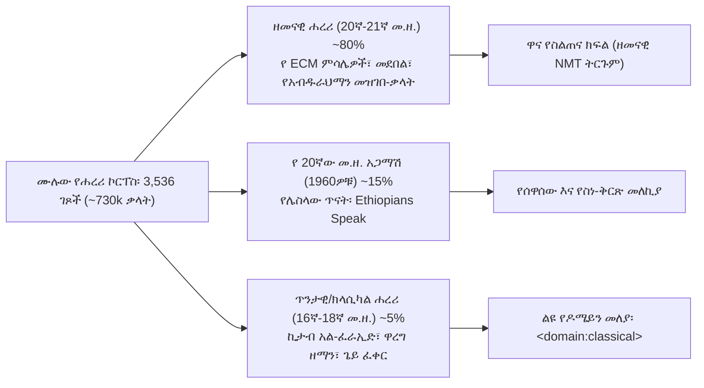
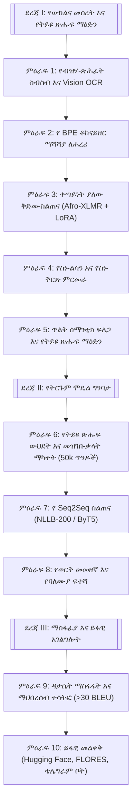
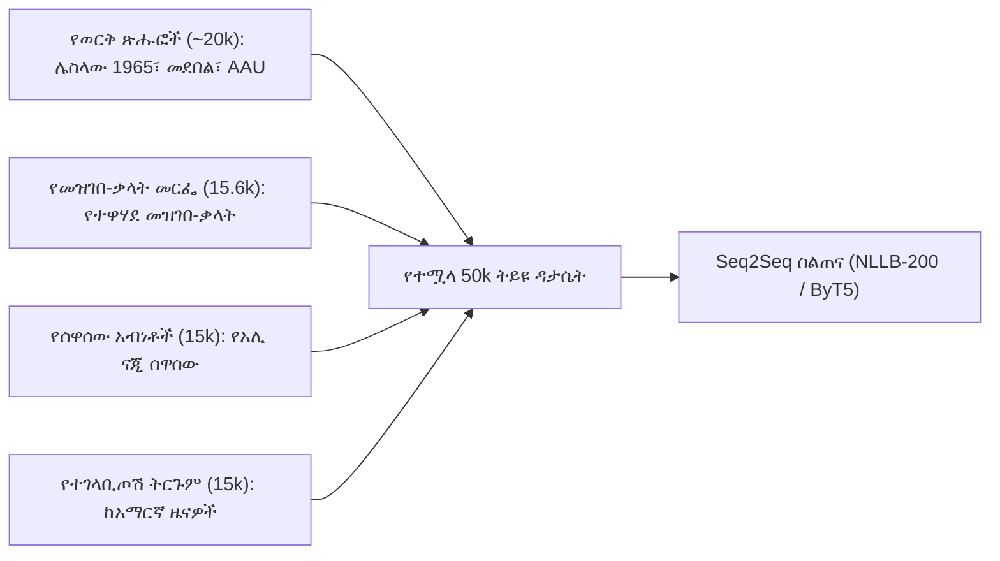
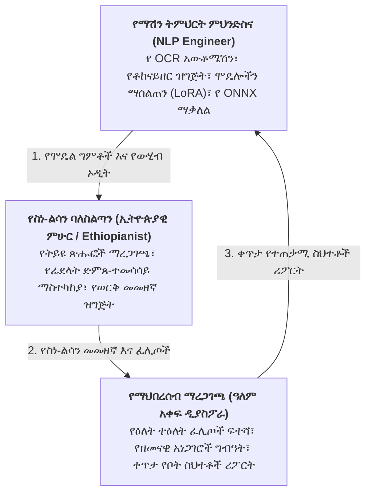

# ሐረሪ NMT (Harari NMT)፡ የውክልና ትምህርት፣ የትይዩ ጽሑፍ ፍለጋ እና የነርቭ ማሽን ትርጉም ለጌይ ሲናን (ሐረሪ)

> **ቋንቋዎች / Languages:** [English](README.md) • [Русский](README_RU.md) • [አማርኛ](README_AM.md)  
> **የፕሮጀክቱ ሁኔታ:** ምዕራፍ 1 በንቃት በመከናወን ላይ (የኦሲአር ዲጂታላይዜሽን እና የኮርፐስ ግንባታ)  
> **ዒላማ ቋንቋ:** ሐረሪ (*ጌይ ሲናን* / Gey Sinan / Harari) · ISO 639-3: `har` · Glottolog: `hara1271` · WALS: `hrr`  
> **የቋንቋ ቤተሰብ:** አፍሮ-እስያዊ → ሴማዊ → ደቡብ ኢትዮ-ሴማዊ (ሐረር ጁጎል፣ ኢትዮጵያ እና ዓለም አቀፍ ዲያስፖራ)

---

## 1. የምርምር ማጠቃለያ እና አስፈላጊነት

የ**ሐረሪ ቋንቋ** (*ጌይ ሲናን*፣ ቃል በቃል «የከተማው ቋንቋ») በምስራቅ ኢትዮጵያ በምትገኘው ጥንታዊቷና በግንብ በታጠረችው **ሐረር ጁጎል** እንዲሁም በሰሜን አሜሪካ፣ አውሮፓ፣ አውስትራሊያ እና መካከለኛው ምስራቅ በሚገኙ የዲያስፖራ ማህበረሰቦች የሚነገር ደቡብ ኢትዮ-ሴማዊ ቋንቋ ነው።

### 1.1. ታሪካዊ ጥልቀት እና የባህል ክብደት፡ የብዙ መቶ ዘመናት የጽሑፍ ቅርስ
የሐረሪ ቋንቋ በአፍሪካ ታሪክ እና በሴማዊ ቋንቋዎች ጥናት ውስጥ ልዩ ቦታ አለው፡
* **የእስልምና የከተማ ምሽግ እና የዩኔስኮ የዓለም ቅርስ፡** በአሚር ኑር ኢብኑ ሙጃሂድ በ16ኛው ክፍለ ዘመን በተገነባው የድንጋይ ግንብ የታጠረችው ሐረር ጁጎል (እ.ኤ.አ. በ2006 የዩኔስኮ ቅርስ ሆና የተመዘገበች)፣ 82 ታሪካዊ መስጊዶችን እና 102 የአውሊያዎች መካነ-መቃብራትን የያዘች የአፍሪካ ቀንድ መንፈሳዊ እና ትምህርታዊ ማዕከል ናት። ይህ ራሱን የቻለ የከተማ ድባብ ጌይ ሲናን ራሱን ጠብቆ እንዲቆይ እና የጽሑፍ ባሕል እንዲያዳብር እንደ ማህበራዊ-ቋንቋዊ ዋሻ ሆኖ አገልግሏል።
* **የአዳል ሱልጣኔት እና የሐረር ኤሚሬት ዋና ከተማ (16ኛ–19ኛ መ.ዘ.)፡** ከ1520 ዓ.ም. ጀምሮ ሐረር በኢማም አህመድ ኢብኑ ኢብራሂም አል-ጋዚ (ግራኝ አህመድ) ዘመን የአዳል ዋና ከተማ ነበረች፣ በኋላም ራሱን የቻለ ኤሚሬት ሆነች። ለ350 ዓመታት ያህል ጌይ ሲናን የቤተ-መንግሥት፣ የንግድ፣ የሸሪዓ ፍርድ ቤቶች እና የሱፊ አስተምህሮ ይፋዊ ቋንቋ ሆኖ አገልግሏል። ኤሚሬቱ የራሱን ገንዘብ (*መሐለቅ*) ያትም ነበር።
* **ከቅኝ ግዛት በፊት የነበረ ብርቅዬ የሰሃራ በታች የጽሑፍ ቅርስ፡** አብዛኞቹ የአፍሪካ ቋንቋዎች በ19ኛው እና በ20ኛው ክፍለ ዘመን በአውሮፓ ሚሲዮናውያን የላቲን ፊደል እስከተዘጋጀላቸው ድረስ የጽሑፍ ባህል ያልነበራቸው ሲሆን፣ የሐረሪ ቋንቋ ግን **ከ16ኛው እና 17ኛው ክፍለ ዘመን ጀምሮ በተሻሻለ ዓረብኛ (አጃሚ)** የተጻፉ በርካታ የብራና ጽሑፎች ባለቤት ነው፡
  * የፊቅህ እና የሸሪዓ ሕግጋት ሰነዶች (*ኪታብ አል-ፈራኢድ* / Kitāb al-Farā'iḍ)፤
  * የታሪክ ዜና መዋዕሎች (የ*ፉቱህ አል-ሐበሻ* የሐረሪ ትርጉም — *ዋረግ ዘማን* / Wareg Zaman)፤
  * የሱፊ መንፈሳዊ ግጥሞች እና ዚክሮች (*ጌይ ፈቀር* / Gey Faqar)፤
  * የጋብቻ፣ የውርስ እና የንግድ ውሎች ሰነዶች።
* **ልዩ የ«ሴማዊ ደሴት» ተፈጥሮ (Semitic Island)፡** በቋንቋ አመዳደብ ሐረሪ በኩሻዊ ቋንቋዎች (በኦሮምኛ እና በሶማሊኛ) የተከበበ እና ከሰሜን ኢትዮ-ሴማዊ ቋንቋዎች (ግዕዝ፣ አማርኛ፣ ትግርኛ) ርቆ ለዘመናት የኖረ ብቸኛ የሴማዊ ቋንቋ ደሴት ነው። ይህ ጂኦግራፊያዊ ገለልተኝነት ጥንታዊ የሴማዊ ቅርጾችን ይዞ እንዲቆይ አስችሎታል።

### 1.2. የስነ-ህዝብ መገለጫ እና የማህበራዊ-ቋንቋዊ ሁኔታ
የሐረሪ ቋንቋ የማህበራዊ-ቋንቋዊ ሁኔታ በክልሉ አጠቃላይ ህዝብ፣ በዲያስፖራው ብዛት እና በትክክለኛ ተናጋሪዎች ቁጥር መካከል ባለው ሰፊ ክፍተት ይገለጻል፡
* **የክልሉ አጠቃላይ ህዝብ፡** በሐረሪ ህዝብ ብሔራዊ ክልላዊ መንግሥት ውስጥ ወደ ~270,000 ሰዎች ይኖራሉ።
* **የብሔር ስብጥር፡** ተወላጅ ሐረሪዎች በራሳቸው ክልል ውስጥ **አናሳ ቁጥር (~8.6%፣ ~20,000–25,000 ሰዎች)** ብቻ ሲሆኑ፣ አብዛኛው ህዝብ የኦሮሞ (~56%) እና የአማራ (~23%) ተወላጅ ነው።
* **የአፍ መፍቻ ቋንቋ ተናጋሪዎች (L1)፡** እ.ኤ.አ. የ2007 የኢትዮጵያ የህዝብ እና ቤት ቆጠራ እንደሚያሳየው በሀገር ውስጥ **25,810 ሰዎች ብቻ** ሐረሪኛን እንደ አፍ መፍቻ ቋንቋ ይናገራሉ።
* **በሁለተኛ ቋንቋነት ተናጋሪዎች (L2)፡** ~8,300 ሰዎች በኢትዮጵያ ውስጥ።
* **በአጠቃላይ በዓለም ዙሪያ የሚናገሩ (L1 + L2 + ዲያስፖራ)፡** ከ **35,000 እስከ 45,000 ሰዎች** ብቻ።
* **የብሔረሰቡ አጠቃላይ ህዝብ በዓለም ላይ፡** ከ **70,000 እስከ 200,000 ሰዎች** (በቶሮንቶ፣ ሜልበርን፣ ዳላስ፣ ጅዳህ ያሉትን ትውልዶች ጨምሮ)።
* **የቋንቋ መጥፋት አደጋ (Language Shift)፡** በዲያስፖራ የሚኖረው ወጣት ትውልድ በፍጥነት ወደ እንግሊዝኛ እየተሸጋገረ ነው። በሐረር ከተማም ውስጥ ቢሆን ለንግድ እና ለዕለት ተዕለት ግንኙነት አማርኛ እና አፋን ኦሮሞ በስፋት ጥቅም ላይ እየዋሉ ነው።

ይህ ክፍተት — እስከ 200,000 የሚደርስ ብሔር በ 35,000 ተናጋሪዎች ብቻ መደገፉ — ዩኔስኮ (UNESCO) ቋንቋውን **በመጥፋት አደጋ ላይ ያለ (Endangered)** ብሎ እንዲፈርጀው አድርጓል።

### 1.3. በማሽን ትርጉም (NLP) ውስጥ ያለው ክፍተት
ምንም እንኳን የብዙ መቶ ዘመናት የጽሑፍ ታሪክ ያለው እና ክልላዊ ይፋዊ ቋንቋ ቢሆንም፣ ሐረሪ በዘመናዊ የኮምፒውተር ቋንቋ ቴክኖሎጂ (NLP) ውስጥ ፈጽሞ የለም፡
* **Google Translate:** 0% ድጋፍ (ሐረሪ አልተካተተም)።
* **Meta NLLB-200:** ሙሉ በሙሉ አልተካተተም (አማርኛ `amh_Ethi`፣ ትግርኛ `tir_Ethi` እና ኦሮምኛ `gaz_Latn` ሲካተቱ ሐረሪ ግን የለውም)።
* **ክፍት ዳታሴቶች (Open Benchmarks)፡** በዓለም አቀፍ ደረጃ በክፍት ምንጭ የተዘጋጀ ትይዩ ዳታሴት፣ የሰለጠነ ሞዴል ወይም መመዘኛ የለም።

ይህ ምርምር **የመጀመሪያውን ክፍት እና የተሟላ የሐረሪ ቋንቋ የነርቭ ማሽን ትርጉም (NMT) ስርዓት እና የ NLP መሰረተ-ልማት** ይገነባል።

---

## 2. የስነ-ቅርጽ፣ የሰዋሰው እና የስነ-ልሳን መገለጫዎች

የሐረሪ ቋንቋ ለተለመዱት የትርጉም ሞዴሎች ልዩ ፈተና የሆኑ ውስብስብ የቋንቋ ቅርጾች አሉት፡

| የስነ-ልሳን ባህሪ | በሐረሪ ቋንቋ ያለው አወቃቀር | ለ NLP እና ለትርጉም ሞዴሎች የሚፈጥረው ፈተና |
| :--- | :--- | :--- |
| **ያልተያያዘ የስርወ-ቃል ሰዋሰው** | ባለ 3-ተነባቢ ስሮች ($\sqrt{C_1 C_2 C_3}$) በ 12 የግሥ ክፍሎች የሚባዙበት | ሰፊ የቃላት መበታተን እና ለቶከናይዘር ከፍተኛ የ OOV መጠን |
| **የአባሪዎች መደራረብ** | ቅድመ-ቅጥያዎች (Rel, Prep) + የግሥ ስር + ጊዜ + የድህረ-ቅጥያ ተሳቢዎች | አንድ ቃል ብቻውን ሙሉ ዓረፍተ-ነገርን የሚወክልበት ሁኔታ |
| **አንጻራዊ የግሥ ቀለበት** | የተቆራረጠ የክበብ አወቃቀር፡ `zi- ... -zāl` | በሞዴሉ ውስጥ ረጅም ርቀት የማስታወስ (Attention) አቅምን የሚጠይቅ |
| **ጥብቅ SOV አወቃቀር** | ግሥ-ፈጻሚ አወቃቀር፣ ድህረ-መስተዋድዶች፣ ገላጮች ከስም ይቀድማሉ | ወደ SVO ቋንቋዎች (እንግሊዝኛ) ሲተረጎም ሰፊ የቦታ መቀያየር ቅጣት |
| **የፊደላት ብዝሃነት እና ድምጸ-ተመሳሳይ** | ግዕዝ/ፊደል፣ የድምፅ ላቲን (Leslau/AAU)፣ ዓረብኛ አጃሚ | የዩኒኮድ NFC መደበኛነት እና ድምጸ-ተመሳሳይ ፊደላትን ማስተካከል ግዴታ መሆኑ |
| **የከተማ ቋንቋ ቅይጥ (ዳይግሎሲያ)** | ከአማርኛ እና ከአፋን ኦሮሞ ጋር በዕለት ተዕለት ንግግር መቀላቀል | የውሂብ መበከልን ለመከላከል ጥብቅ የቋንቋ መለያ ማጣሪያዎችን መጠቀም |


### 2.1. ያልተያያዘ የስርወ-ቃል እና የቅርጽ መዋቅር (Root-and-Pattern)
እንደ አብዛኞቹ ሴማዊ ቋንቋዎች፣ የሐረሪ ቋንቋ የስም እና የግሥ ስርዓት ባለ ሦስት ተነባቢ ስሮች ($\sqrt{C_1 C_2 C_3}$) እና ውስጣዊ የድምፅ ለውጦች (ablaut) ላይ የተመሰረተ ነው። የሐረሪ ሰዋሰው ግሦችን በ **12 የተለያዩ መደቦች** (ክፍል A፣ B፣ C እና ተዛማጅ ቅጥያዎች) ይከፍላቸዋል። ከአንድ ስርወ-ቃል በደርዘን የሚቆጠሩ ቅርጾች ስለሚወጡ፣ ይህም ለቶከናይዘር የቃላት መበታተን (vocabulary dispersion) እና አዳዲስ ቃላትን የማወቅ ፈተና (OOV) ይፈጥራል።

### 2.2. የአባሪዎች መደራረብ (Agglutinative Clitic Stacking)
ከሰሜን ኢትዮ-ሴማዊ ቋንቋዎች በተለየ፣ በሐረሪ ግሥ ላይ በርካታ ሰዋሰዋዊ አባሪዎች ተከታትለው ይሰካሉ። አንድ ቃል ሙሉ ዓረፍተ-ነገርን ይወክላል፡
$$\text{አንጻራዊ} + \text{መስተዋድድ} + \text{ባለቤት} + \text{የግሥ ስር} + \text{ጊዜ/ሁኔታ} + \text{ተሳቢ}$$
* *ምሳሌ፡* `zit-habarkā-ñ` (ዚትሐበርካኝ)
  * ዝርዝር፡ `zi-` (አንጻራዊ፡ *የ... ነገር*) + `t-` (ተገብሮ) + `habar` (ስርወ-ቃል፡ *መጠየቅ*) + `-kā` (ባለቤት፡ *አንተ*) + `-ñ` (ተሳቢ፡ *እኔን*)።
  * ትርጉም፡ *«የጠየቅኸኝ ነገር»*።

### 2.3. አንጻራዊ የግሥ ቀለበት (`zi-` ... `-zāl`)
በአሁን እና ወደፊት ጊዜ ውስጥ አንጻራዊ ዓረፍተ-ነገሮች በቅድመ-ቅጥያ እና ድህረ-ቅጥያ ቀለበት ይዋቀራሉ፡
* **የኃላፊ ጊዜ (Perfective)፡** በ `zi-` ቅድመ-ቅጥያ ብቻ (ለምሳሌ፡ `zidiǧa` — *«የመጣው»*)።
* **የአሁን/ወደፊት ጊዜ (Imperfective)፡** በ `zi-` እና በ `-zāl` መካከል ይዘጋል (ለምሳሌ፡ `yidīǧzāl` — *«የሚመጣው»*፣ በብዙ ቁጥር `yidīǧzālu` — *«የሚመጡት»*)።

### 2.4. የዓረፍተ-ነገር አወቃቀር፡ ጥብቅ SOV
* **የቃላት ቅደም ተከተል፡** በጥብቅ **ባለቤት – ተሳቢ – ግሥ (SOV)**። ረዳት ግሦች እና አስረጅዎች ዓረፍተ-ነገሩን ይዘጋሉ።
* **መስተዋድዶች፡** ድህረ-መስተዋድዶች እና ከባቢ መስተዋድዶች ያመዝናሉ (ለምሳሌ፡ `be-...-le` ለምክንያት፣ `le-...-gir` ለሁኔታዊ አገባብ)።
* **የስም ሀረግ፡** ገላጮች (ቅጽሎች፣ አመልካች መስተአምሮች፣ አንጻራዊ ሀረጎች) ሁልጊዜ ከሚገለጸው ስም ይቀድማሉ።

### 2.5. የፊደላት ብዝሃነት እና የኦርቶግራፊ ፈተናዎች
የሐረሪ ጽሑፎች በሦስት የስክሪፕት አይነቶች ይገኛሉ፡
1. **የኢትዮጵያ ፊደል (ግዕዝ)፡** የዘመኑ ይፋዊ የትምህርት እና የመንግሥት ጽሕፈት። በዩኒኮድ ደረጃ የተሟላ ሲሆን፣ ልዩውን የላንቃ ድምፅ **«ጘ»** (ከ `ጘ` U+1318 እስከ `ጞ` U+131E) ያካትታል።
2. **የድምፅ ላቲን (IPA Transcription)፡** በ 20ኛው መ.ዘ. የሌስላው ጥናቶች (1963, 1965) እና በአዲስ አበባ ዩኒቨርሲቲ ዲሰርቴሽኖች ውስጥ የተተገበረ።
3. **ዓረብኛ አጃሚ (عجمي)፡** ከ 16ኛው እስከ 20ኛው መ.ዘ. መጀመሪያ ድረስ በብራናዎች ላይ የዋለ።
4. **የግዕዝ ድምጸ-ተመሳሳይ ፊደላት ወጥመድ፡** ልክ እንደ አማርኛ፣ በፊደል ውስጥ ድምጸ-ተመሳሳይ ፊደላት አሉ፡
   * `ሀ / ሐ / ኀ` (ሁሉም /h/)፣ `ሰ / ሠ` (/s/)፣ `ጸ / ፀ` (/sʼ/)።
   * እነዚህን በዩኒኮድ ደረጃ ማስተካከል (NFC Normalization) የሞዴሉን መዝገበ-ቃላት ላለመበተን ወሳኝ ነው።

### 2.6. የከተማ ቋንቋ ቅይጥ (Code-Switching)
በሐረር ጁጎል ውስጥ የተደረጉ ጥናቶች (የናዲያ አሊ 2015 ጥናት) እንደሚያሳዩት፣ በዕለት ተዕለት ንግግር ውስጥ የአማርኛ ስሞች፣ የኦሮምኛ ግሦች እና የዓረብኛ ቃላት በስፋት ይቀላቀላሉ። የትርጉም ሞዴሉ ይህን አውቆ ንጹሕ ትርጉም እንዲሰጥ የዶሜይን ማጣሪያ ያስፈልገዋል።

---

## 3. የታሪካዊ ዘመናት የኮርፐስ ክፍፍል

የተለያዩ ዘመናት ጽሑፎችን ያለ ልዩነት ለሞዴሉ መስጠት የቅጥ መዛባትን ያስከትላል። 3,536 ገጾች ያሉት ኮርፐስ በሦስት ዘመናት ተከፍሏል፡



1. **ዘመናዊ ሐረሪ (20ኛ–21ኛ መ.ዘ.) — ~80% የኮርፐሱ፡** የዕለት ተዕለት ቃላት፣ የዘመኑ የንግድ እና የመንግሥት ጽሑፎች።
2. **የ 20ኛው መ.ዘ. አጋማሽ (1950–1960ዎቹ) — ~15% የኮርፐሱ፡** በቮልፍ ሌስላው የተመዘገቡ ከፍተኛ የቋንቋ ደረጃ ያላቸው ትይዩ ዓረፍተ-ነገሮች።
3. **ክላሲካል ሐረሪ (16ኛ–18ኛ መ.ዘ.) — ~5% የኮርፐሱ፡** የፉቱህ አል-ሐበሻ ትርጉም (*ዋረግ ዘማን*)፣ የሸሪዓ ሕግጋት (*ኪታብ አል-ፈራኢድ*) እና መንፈሳዊ ግጥሞች (*ጌይ ፈቀር*)።

---

## 4. አነስተኛ-ሀብት ቋንቋዎች (Low-Resource NLP) የቴክኒክ ፈተናዎች

### 4.1. ከባዶ (From Scratch) ማሰልጠን ለምን እንደማይሰራ
ትራንስፎርመርን ከባዶ ማሰልጠን በሚሊዮኖች የሚቆጠሩ ትይዩ ዓረፍተ-ነገሮችን ይፈልጋል። ከ 50,000 ባነሰ መረጃ ሞዴሉ የቃላት ቅደም ተከተል እንኳን መማር አይችልም (BLEU < 8) እና ቃላትን ወደ መድገም ያመራል።

### 4.2. የኢንኮደር እና የ Seq2Seq አርክቴክቸር ወጥመድ
እንደ **Afro-XLMR** ወይም **EthioBERT** ያሉ ኢንኮደሮች ብቻቸውን ለትርጉም አይሰሩም፤ ምክንያቱም ጽሑፍ የሚያመነጭ ዲኮደር የላቸውም። ሁለት ኢንኮደሮችን ማጣመር ደግሞ የ Cross-Attention ክብደቶችን በዘፈቀደ ድምፅ ስለሚሞላው ብዙ ዳታ ይፈልጋል።
* **መፍትሔው፡** የተሟላ Seq2Seq ሞዴል (**NLLB-200** ወይም **ByT5**) በመጠቀም **አማርኛን (`amh_Ethi`) እንደ ለጋሽ ቋንቋ (Donor Language)** መውሰድ። ሁለቱም ፊደልን፣ የ SOV አወቃቀርን እና የሴማዊ ስሮችን ይጋራሉ።

### 4.3. የቶከናይዘር የፍጥነት እና የክፍፍል ችግር (Fertility Rate)
የተለመዱ ቶከናይዘሮች የግዕዝ ፊደላትን ወደ 2–4 ባይቶች ይሰብሯቸዋል (Byte Fallback)። ይህም የኮንቴክስት ርዝመትን ያበዛል እና የማስታወስ አቅምን ያጣብባል።
* **መፍትሔ ሀ፡** የ BPE ቶከናይዘርን በሐረሪ አባሪዎች ማበልጸግ።
* **መፍትሔ ለ፡** ቶከናይዘር የሌለውን **ByT5** ሞዴል መጠቀም።

### 4.4. የትርጉም አቅጣጫ አለመመጣጠን
* **ከሐረሪ $\rightarrow$ ወደ እንግሊዝኛ/አማርኛ፡** በጣም ቀላል ነው። ኢንኮደሩ ከሐረሪ ትርጉሙን ያወጣል፣ ዲኮደሩ ደግሞ በቢሊዮን ቃላት በሰለጠነ ቋንቋ ያመነጫል።
* **ከእንግሊዝኛ/አማርኛ $\rightarrow$ ወደ ሐረሪ፡** ስህተት የመከሰት ዕድሉ ከፍተኛ ነው። 12ቱን የግሥ መደቦች፣ አባሪዎችን እና ትክክለኛ ፊደላትን መምረጥ ይጠይቃል።

### 4.5. የድሮ ፎንቶች የኢንኮዲንግ ወጥመድ (GeezType Trap)
በ 1990ዎቹ የታተሙ መጻሕፍት በ 8-ቢት ፎንቶች (*GeezType, Visual Ge'ez*) የተጻፉ በመሆናቸው ቀጥታ ሲገለበጡ የማይነበብ ቆሻሻ ጽሑፍ (`›vÉ N[] KËT]<`) ይሰጣሉ።
* **መፍትሔው፡** ገጾቹን በሙሉ እንደ ምስል አይቶ ወደ ንጹሕ ዩኒኮድ የሚቀይር **Vision OCR** (`gemini-3.5-flash-lite`) መጠቀም።

### 4.6. የጽሕፈት መኪና (Typewriter) የኦሲአር ፈተናዎች
እንደ 1984ቱ የአብዱራህማን መዝገበ-ቃላት ያሉ መጻሕፍት በጽሕፈት መኪና የተጻፉ በመሆናቸው የቀለም መደብዘዝ ፊደላትን ያመሳስላል (`ሊ` እና `ሒ`፣ `ደ` እና `ጀ`)። የተለመደው Tesseract 70% ብቻ ሲያነብ፣ የላቁ የቪዥን ሞዴሎች ግን በአውዱ ተረድተው በትክክል ያነባሉ።

---

## 5. የተሟላው የ 10 ምዕራፎች የምርምር ማስተር-ፕላን



### ምዕራፍ 1፡ ጠንካራ Vision OCR እና የዳታ ቅበላ
* አውቶሜትድ ስክሪፕት `batch_ocr_books.py`።
* ሞዴል፡ ዋናው `gemini-3.5-flash-lite`፣ ተጠባባቂው `gemini-3.1-flash-lite`።
* ጥብቅ የታግ ገደቦች (`<TRANSCRIPTION>...</TRANSCRIPTION>`)።

### ምዕራፍ 2፡ የቶከናይዘር ማሻሻያ ለሐረሪ ሰዋሰው
* የ Afro-XLMR ቶከናይዘርን ፍጥነት መለካት።
* የ BPE ሞዴልን በንጹሕ የሐረሪ ጽሑፍ ላይ ማሰልጠን እና የሐረሪ አባሪዎችን (`-ዛል`, `-ዚዩ`, `-ሌ`, `-አች`) ማካተት።

### ምዕራፍ 3፡ ቀጣይነት ያለው ቅድመ-ስልጠና (Afro-XLMR + LoRA)
* መነሻ ሞዴል፡ `Davlan/afro-xlmr-base`።
* ግብ፡ Masked Language Modeling (MLM) በ 15% ጭንብል እና LoRA ($r=16, \alpha=32$)።

### ምዕራፍ 4፡ የስነ-ልሳን ምርመራ (Linguistic Probing)
* የ Perplexity ቅነሳን መከታተል እና የስነ-ቅርጽ ምርመራዎችን (Plural, Possessive, Relative) ማካሄድ።

### ምዕራፍ 5፡ የትይዩ ጽሑፍ ፍለጋ (Bitext Mining)
* የዜና ማሰራጫዎችን (የሐረሪ መገናኛ ብዙኃን ኤጀንሲ) ትይዩ ዜናዎች በኮሳይን ተመሳሳይነት ማውጣት።

### ምዕራፍ 6፡ የ 50,000 ትይዩ ዓረፍተ-ነገሮች ዳታሴት ግንባታ



1. **የወርቅ ትይዩ ጽሑፎች (~20,000 ዓረፍተ-ነገሮች)፡** ሌስላው 1965 (~4,500)፣ መደበል (~2,500)፣ የዩኒቨርሲቲ ዲሰርቴሽኖች (~3,500)፣ የተፈለፈሉ ዜናዎች (~10,000)።
2. **የመዝገበ-ቃላት ትይዩ (15,648 ጥንዶች)፡** የ `harari_unified_dictionary.csv` ቃላትን ወደ ዓረፍተ-ነገር መልክ ማስገባት።
3. **የሰዋሰው አብነቶች (~15,000 ዓረፍተ-ነገሮች)፡** ቃላትን በአሊ ናጂ የሰዋሰው ቀመሮች ውስጥ መተካት።
4. **የተገላቢጦሽ ትርጉም (Back-Translation, ~15,000 ዓረፍተ-ነገሮች)፡** የአማርኛ ዜናዎችን ወደ ሐረሪ መተርጎም።

### ምዕራፍ 7፡ የ Seq2Seq ትራንስፈር ስልጠና (NLLB-200 እና ByT5)
* ዋና ሞዴል፡ `facebook/nllb-200-distilled-600M` አማርኛን (`amh_Ethi`) እንደ ለጋሽ በመጠቀም።
* አማራጭ፡ `google/byt5-base`።
* የዶሜይን መለያዎች፡ `<domain:modern>`, `<domain:pedagogical>`, `<domain:classical>`።

### ምዕራፍ 8፡ የወርቅ መመዘኛ እና የባለሙያ ፍተሻ (Human-in-the-Loop)
* 300–500 ዓረፍተ-ነገሮችን የያዘ የወርቅ መመዘኛ ማዘጋጀት።
* በኢትዮጵያ ጥናት ባለሙያ (Ethiopianist) የዓረፍተ-ነገር ወሰኖችን እና ፊደላትን ማረጋገጥ።

### ምዕራፍ 9፡ ዳታሴት ማስፋፋት እና የማህበረሰብ ተሳትፎ (v2.0)
* **የትይዩ ዳታሴት ማስፋፊያ፡** ከተጨማሪ የመንግሥት ሰነዶች እና ዜናዎች መረጃ ማሰባሰብ።
* **የድምፅ ትራንስክሪፕሽን (Voice-to-Text / ASR)፡** ከዩቲዩብ የቪዲዮ ስርጭቶች (*Harari Broadcasting Network*, >500 ሰዓታት) ድምፅን ወደ ጽሑፍ የሚቀይር ሞዴል በማዘጋጀት ለትርጉም መጠቀም።
* **የማህበረሰብ ማረጋገጫ፡** የዲያስፖራ ማህበረሰቦችን በማሳተፍ የትርጉም ጥራቱን ወደ **>30 BLEU / chrF++ > 55** ማሳደግ።

### ምዕራፍ 10፡ ይፋዊ መልቀቅ እና አገልግሎቶች
* የ FLORES መመዘኛን ለ Google Translate እና Meta NLLB ማቅረብ።
* የሞዴሉን ክብደቶች በ Hugging Face ላይ መልቀቅ (`bogdanborovoy/harari-nmt-nllb600m`)።
* በ ONNX INT8 የሚሰራ ቀላል የቴሌግራም/ዋትስአፕ የትርጉም ቦት ማዘጋጀት።

---

## 6. የሰው እና የኮምፒውተር የኃላፊነት ክፍፍል (Human-in-the-Loop)



* **የማሽን ትምህርት ምህንድስና (NLP Engineer)፡** የ OCR አውቶሜሽን፣ የቶከናይዘር ዝግጅት፣ የሞዴል ስልጠና፣ የ ONNX ማቃለል እና የቦቶች ግንባታ።
* **የስነ-ልሳን ባለስልጣን (ኢትዮጵያዊ ምሁር / Ethiopianist)፡** የትይዩ ጽሑፎች ትክክለኛነት፣ የግዕዝ ፊደላት ድምጸ-ተመሳሳይ ማስተካከያ፣ የወርቅ መመዘኛ ማዘጋጀት እና የስህተት ትንተና።
* **የማህበረሰብ ማረጋገጫ (ዓለም አቀፍ ዲያስፖራ)፡** የዕለት ተዕለት አነጋገሮች፣ ዘመናዊ ፈሊጦች እና የዲያሌክቶች ፍተሻ።

---

## 7. ከስራ ማስጀመር በኋላ ያለው እውነታ እና «ዲጂታል መርከብ»

### 7.1. ሳይንሳዊ እና ሰብዓዊ ተልዕኮ («ዲጂታል መርከብ»)
* ይህ ፕሮጀክት ሙሉ በሙሉ ለትርፍ ያልተቋቋመ፣ ክፍት ሳይንሳዊ የቋንቋ ጥበቃ ጥናት ነው (Digital Language Preservation)።
* ዋነኛ ዓላማው በመጥፋት አደጋ ላይ ያለን ቋንቋ መታደግ፣ የብዙ መቶ ዘመናት የታሪክ እና የባህል ቅርሱን መጠበቅ እና ለተመራማሪዎች እንዲሁም ለዲያስፖራው ክፍት የዲጂታል መሳሪያዎችን ማቅረብ ነው።

### 7.2. የማህበረሰብ ተደራሽነት እና ቀላል የኢንፈረንስ ወጪ
ያለ ከፍተኛ የጂፒዩ (GPU) ወጪ ማህበረሰቡ ሁልጊዜ በነፃ እንዲጠቀምበት፡
* ሞዴሉ ወደ **ONNX Runtime (INT8)** ይቀነሳል።
* ይህም በአንድ ዓረፍተ-ነገር ከ 200 ሚሊሰከንድ ባነሰ ጊዜ ውስጥ በተራ ባለ 2-ኮር ሲፒዩ (CPU) ላይ እንዲሰራ ያስችለዋል።

### 7.3. የኦርቶግራፊ ማስተካከያ
በማህበረሰቡ ውስጥ የሚነሱ የቃላት አጠቃቀም ክርክሮችን ለመፍታት የግልጽ ድምፅ አሰጣጥ እና ውይይት መድረክ ይዘጋጃል።

---

## 8. የተሰበሰበው አካላዊ ኮርፐስ እና የኦሲአር ሂደት

በአጠቃላይ **20 መጻሕፍት፣ 3,536 ገጾች**፣ በድምሩ **~730,000 ቃላት (~1.8 ሚሊዮን ቶከኖች)** ተሰብስበዋል፡

### 8.1. የታተሙ መጻሕፍት ቤተ-መጽሐፍት (`books/`) — 2,341 ገጾች (~480,000 ቃላት)

| መጽሐፍ | ገጽ | መጠን | የስነ-ልሳን ይዘት እና ሚና |
| :--- | :---: | :---: | :--- |
| `ECM_proverbs_239p.pdf` | 239 | 0.9 MB | **ፊደል፣ ሁለት ቋንቋ፡** ምሳሌያዊ አነጋገሮች፣ ፈሊጦች። በ OCR ሙሉ በሙሉ የተነበበ (37.5k ቃላት)። |
| `MEDEBEL.PDF.pdf` | 249 | 13.4 MB | **ፊደል፣ ትይዩ ታሪክ፡** ሐረሪ $\leftrightarrow$ አማርኛ ትይዩ ጽሑፎች። በ OCR የተነበበ (58.0k ቃላት)። |
| `BreakdownHarariGrammerEH.pdf` | 151 | 4.7 MB | **ፊደል + ላቲን፡** የአሊ ናጂ ሰዋሰው። የግሥ እርባታ እና ዓረፍተ-ነገሮች (38.8k ቃላት)። |
| `LesluHarariDictionary145.pdf` | 86 | 22.2 MB | **ላቲን / IPA፡** የቮልፍ ሌስላው መዝገበ-ቃላት (1963)። የስርወ-ቃል ጥናት (80.3k ቃላት)። |
| `Wareg_Sinan_0001watermark.pdf` | 49 | 17.0 MB | **ፊደል፣ ፈሊጦች፡** የቋንቋው ፈሊጣዊ አነጋገሮች (7.9k ቃላት)። |
| `HIBIRI_WA_GIBERY.pdf` | 79 | 1.2 MB | **ፊደል፣ ተረቶች፡** የልጆች ተረቶች እና አጫጭር ታሪኮች (11.2k ቃላት)። |
| `Wareg_Zaman-1_2.pdf` | 163 | 20.9 MB | **ታሪክ (ክፍል 1)፡** የፉቱህ አል-ሐበሻ ሐረሪ ትርጉም (~37k ቃላት)። በሂደት ላይ (132/163 ገጽ)። |
| `Wareg_Zaman-2_2.pdf` | 164 | 22.1 MB | **ታሪክ (ክፍል 2)፡** ተከታታይ ታሪካዊ ጽሑፍ (~38k ቃላት)። በተራ ላይ። |
| `keetab-fraeed.pdf` | 104 | 11.5 MB | **የሸሪዓ ሕግ፡** ኪታብ አል-ፈራኢድ በፊደል (~21k ቃላት)። በተራ ላይ። |
| `Radinet_Ahdi_Khalid_4Print112.pdf` | 80 | 1.6 MB | **ባህል፡** የሐረሪ የጋብቻ ሥነ-ሥርዓት እና ባሕል (~14k ቃላት)። በተራ ላይ። |
| `ECBHararisong.pdf` | 206 | 32.1 MB | **ጌይ ፈቀር፡** ባህላዊ እና መንፈሳዊ ግጥሞች፣ ዚክሮች (~28k ቃላት)። በተራ ላይ። |
| `ECeleewaleeme.pdf` | 111 | 2.8 MB | **እሊ ወሊሚ፡** አፈ-ታሪኮች እና እንቆቅልሾች (~20k ቃላት)። በተራ ላይ። |
| `Ethiopians_Speak-Harari_Wolf_Leslau_s.pdf` | 284 | 75.0 MB | **የወርቅ ትይዩ (ሌስላው 1965)፡** ~4,000–5,000 ትይዩ ዓረፍተ-ነገሮች ከዝርዝር ሰዋሰው ጋር። በተራ ላይ። |
| `Abdurahman-Harari-Amharic-Dectionery.pdf` | 239 | 82.8 MB | **ጩቅቲ ኪታብ፡** የዶክተር አብዱራህማን የ 40,000 ቃላት መዝገበ-ቃላት። በተራ ላይ። |
| `sophomore_harari.pdf` | 137 | 1.3 MB | **የዩኒቨርሲቲ ንባብ፡** የአሊ ናጂ እና አሚር አሊ አቂል ጽሑፎች። በተራ ላይ። |

### 8.2. የአዲስ አበባ ዩኒቨርሲቲ (AAU) ጥናቶች (`aau university/`) — 1,195 ገጾች (~250,000 ቃላት)

OCR የማያስፈልጋቸው ዲጂታል ዩኒኮድ ፒዲኤፎች፡
* **ቤንያም ሚቲኩ (2013)** — *Harari Language: A Descriptive Grammar* (**625 ገጾች**)። የተሟላ ሰዋሰው እና የሐረር ኤፍኤም ጽሑፎች።
* **አብዱልሐሚድ አብዱላሂ (2025)** — የ*ኪታብ አል-ፈራኢድ* ዘመናዊ ትርጉም (**272 ገጾች**)።
* **ቤንያም ሚቲኩ (2004)** — *Noun Phrase Structure in Harari* (**116 ገጾች**)።
* **ናዲያ አሊ (2015)** — *Code-Switching in Oromiffa and Harari* (**91 ገጾች**)፣ የቀጥታ ንግግር ቅጂዎች።
* **ቢንያም ኃይሉ (2021)** — *Influence of Arab and Asian Traders on Harari Cultural Identity* (**91 ገጾች**)።

### 8.3. የተጠናቀሩ የቃላት ዳታሴቶች (`data/`)

* **`harari_unified_dictionary.csv`:** **15,648 የተዋሃዱ የቃላት ምዝገባዎች** (ፊደል፣ ላቲን፣ ዓረብኛ አጃሚ ከአማርኛ እና እንግሊዝኛ ትርጉም ጋር)።
* **`harari_pure_text.txt`:** **15,647 ንጹሕ የሐረሪ መስመሮች** (~20,390 ቃላት) ለቅድመ-ስልጠና የተዘጋጁ።
* **`corpus_stats.json`:** የኮርፐሱ የስታቲስቲክስ መረጃ።

---

## 9. የቀሩት የውጭ እና የዲጂታል ምንጮች

| የመረጃው አይነት | መድረክ / ቻናል | የሚገኝ ግምት | በምርምር ሂደቱ ውስጥ ያለው ሚና |
| :--- | :--- | :--- | :--- |
| **የክልሉ ዜናዎች** | ቴሌግራም (`@hararimassmediaagency`, `@HarariGovernmentCommunication`) | ~30k–50k ቃላት | ያልተጣመረ ንጹሕ ጽሑፍ ለቅድመ-ስልጠና (MLM) |
| **ይፋዊ የመንግሥት መግለጫዎች** | ፌስቡክ (የሐረሪ መገናኛ ብዙኃን፣ የመንግሥት ኮሙኒኬሽን) | ~10k–15k ጥንዶች | አውቶሜትድ የትይዩ ጽሑፍ ማዕድን (ሐረሪ ↔ አማርኛ) |
| **ዲጂታል መዝገበ-ቃላት** | Harari Word Translate (HWT Android)፣ Glosbe TM | ~2,000 ቃላት | የመዝገበ-ቃላት ማካተት (Lexicon Injection) |
| **የድምፅ ማህደሮች** | ዩቲዩብ (*Harari Broadcasting Network*፣ >10,000 ቪዲዮዎች) | >500 ሰዓታት | ለድምፅ ትራንስክሪፕሽን (Voice-to-Text / ASR) |
| **የዲያስፖራ ማዕከላት** | ሜልበርን (Saay Harari)፣ ቶሮንቶ፣ ዳላስ | ጥራት ያለው ውሂብ | የማህበረሰብ ፍተሻ እና የወርቅ መመዘኛ ማረጋገጫ |

> [!NOTE]
> **የተገለሉ ምንጮች፡** የፌዴራል መንግሥት ገጾች 0% የሐረሪ ጽሑፍ አላቸው (አማርኛ፣ ኦሮምኛ እና እንግሊዝኛ ብቻ)፤ የሐረማያ ዩኒቨርሲቲ ሰርቨር አይሰራም እና የግብርና ትኩረት ያለው ነው፤ የዊኪሚዲያ ኢንኩቤተር (`Wp/har`) ደግሞ ባዶ ነው።


### 9.1. የቴሌግራም ቻናሎች (ንጹሕ UTF-8 ዘመናዊ ጽሑፍ)
* **`@hararimassmediaagency`:** የዕለት ተዕለት የክልሉ ዜናዎች በፊደል።
* **`@HarariGovernmentCommunication`:** ይፋዊ የመንግሥት መግለጫዎች እና መመሪያዎች።
* **`@CoolHarari`:** የቃላት ካርዶች፣ ምሳሌያዊ አነጋገሮች እና የዘመኑ ግጥሞች።
* **የሚገኝ ግምት፡** ~30,000–50,000 ቃላት ንጹሕ ጽሑፍ።

### 9.2. የክልሉ ፌስቡክ ገጾች (የትይዩ ጽሑፍ ምንጭ)
* **Harari Mass Media Agency (HBN)** (81,000 ተከታዮች)።
* **Harari Government Communication Affairs Office:** ዜናዎች በተመሳሳይ ጊዜ በሐረሪ እና በአማርኛ ይለጠፋሉ።
* **Harari Region Prosperity Party:** የፖለቲካ እና የኢኮኖሚ ቃላት።
* **Harari Broadcasting Network Sport:** የስፖርት ዘገባዎች።

### 9.3. የዲያስፖራ የሞባይል አፕሊኬሽኖች
* **Harari Word Translate (HWT)** በ MCITS (Android)፡ የ 4 ቋንቋዎች መዝገበ-ቃላት።
* **Glosbe Translation Memory (`glosbe.com/en/har`):** ~1,000 ትይዩ ዓረፍተ-ነገሮች።
* **Reddit `r/Ethiopia`:** የቋንቋ ውይይቶች ማህደር።

### 9.4. የዓለም አቀፍ ዲያስፖራ ማዕከላት
* **አውስትራሊያ (ሜልበርን)፡** *Australian Saay Harari Association* / *Hararian Organization* (`hararian.org`)።
* **ካናዳ (ቶሮንቶ)፡** *Harari Heritage Centre* (Scarborough, ON)።
* **አሜሪካ (ዳላስ)፡** *Hararis United* (`hararisunited.org`)፣ *Harari Community Development Center*።
* **እንግሊዝ (ለንደን)፡** *Harari Community in the UK*።

### 9.5. የድምፅ ማህደሮች (Voice-to-Text / ASR)
* **Harari Broadcasting Network (HBN) በዩቲዩብ፡** ከ 10,000 በላይ ቪዲዮዎች (>500 ሰዓታት ንግግር) ለድምፅ ትራንስክሪፕሽን የሚሆኑ።

### 9.6. የተገለሉ ምንጮች (አሉታዊ ግኝቶች)
* **የፌዴራል መንግሥት ገጾች (0% ሐረሪ)፡** የጠቅላይ ሚኒስትር ጽ/ቤት እና ሚኒስቴሮች በአማርኛ፣ ኦሮምኛ እና እንግሊዝኛ ብቻ ይሰራሉ።
* **የሐረማያ ዩኒቨርሲቲ ሰርቨር (`ir.haramaya.edu.et`)፡** በኔትወርክ አይገኝም፣ ትኩረቱም ግብርና እና ህክምና ነው።
* **Wikimedia Incubator (`Wp/har`)፡** አንድ ባዶ ገጽ ብቻ።

---

## 10. የፋይሎች መዋቅር (Repository Structure)

```
harari-nmt/
├── README.md                           # በእንግሊዝኛ የተዘጋጀ ዝርዝር የምርምር ሰነድ
├── README_RU.md                        # በሩሲያኛ የተዘጋጀ ዝርዝር የምርምር ሰነድ
├── README_AM.md                        # በአማርኛ የተዘጋጀ ይፋዊ የምርምር ሰነድ
├── batch_ocr_books.py                  # የ Vision OCR አውቶሜሽን ስክሪፕት (Gemini Flash Lite)
├── harari_internet_sources.md           # የተሟላ የድረ-ገጽ እና የአካዳሚክ ምንጮች ዝርዝር
├── harari_books_links.md                # የታሪክ እና የቋንቋ መጻሕፍት ማውረጃ ማስፈንጠሪያዎች
├── data/
│   ├── harari_unified_dictionary.csv    # 15,648 ቃላት ያሉት ባለብዙ-ስክሪፕት መዝገበ-ቃላት
│   ├── harari_pure_text.txt             # ንጹሕ የሐረሪ ጽሑፍ (15,647 መስመሮች)
│   └── corpus_stats.json               # የዳታ ስታቲስቲክስ
└── books/
    └── texts/
        ├── <book_slug>/                 # የገጽ-በገጽ የ OCR ጽሑፎች
        └── <book_slug>_FULL.txt         # የተዋሃዱ የተሟሉ የመጻሕፍት ጽሑፎች
```

> **የመረጃ እና የኮርፐስ ማስታወሻ፡** ዋናዎቹ የፒዲኤፍ መጻሕፍት (~400 MB)፣ የ OCR ጽሑፎች (`books/texts/`) እና የተጠናቀሩት የመዝገበ-ቃላት ፋይሎች (`data/`) በ `.gitignore` አማካኝነት በአካባቢያዊ ማከማቻ (local) ላይ ተይዘዋል። በምዕራፍ 10 ላይ የተጣሩ ዳታሴቶች በይፋ በ Hugging Face ላይ ይለቀቃሉ።

---

## 11. ፈጣን ማስጀመሪያ እና አካባቢ (Quickstart)

### ቅድመ-ሁኔታዎች
* Python 3.10+
* PyMuPDF (`pip install pymupdf`)
* የ Google Generative AI API ቁልፍ

### የ OCR ስክሪፕቱን ለማስኬድ
```bash
export GEMINI_API_KEY="የእርስዎ_api_ቁልፍ"
python3 batch_ocr_books.py --concurrency 2
```

አንድ መጽሐፍ ብቻ ለይቶ ለማስኬድ፡
```bash
python3 batch_ocr_books.py --book "Wareg_Zaman"
```

---

## 12. ማጣቀሻ (Citation)

ይህን ዳታሴት ወይም የምርምር ማዕቀፍ በጥናትዎ ውስጥ ከተጠቀሙበት እባክዎን የሚከተለውን ጠቅሰው ያመልክቱ፡

```bibtex
@misc{borovoy2026harari,
  author       = {Borovoy, Bogdan},
  title        = {Harari NMT: Representation Learning, Bitext Mining, and Neural Machine Translation for the Harari Language},
  year         = {2026},
  publisher    = {GitHub},
  howpublished = {\url{https://github.com/bogdanborovoy/harari-nmt}}
}
```

---

*ዶክመንቴሽኑ በሚከተሉት ቋንቋዎች ይገኛል፡ [English](README.md) • [Русский](README_RU.md) • [አማርኛ](README_AM.md)*
