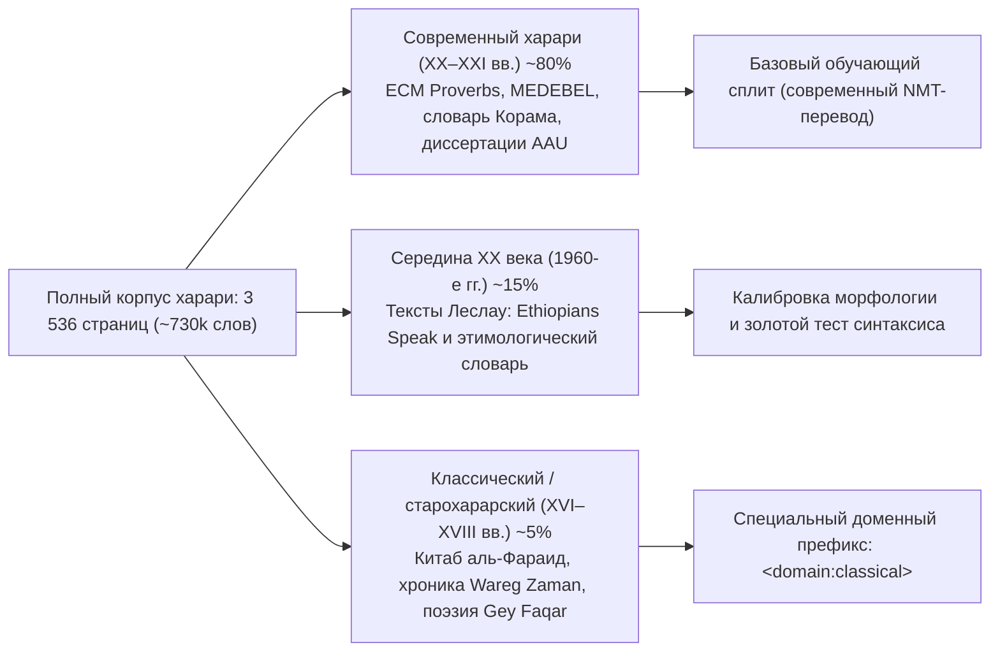
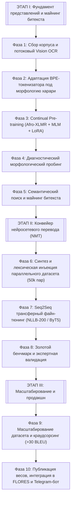
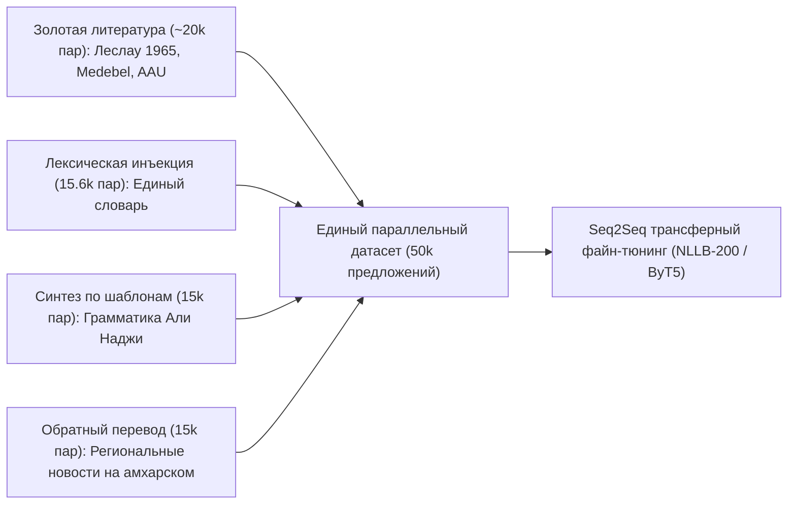
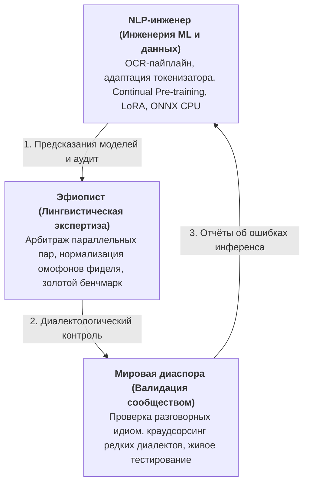

# Harari NMT: Изучение представлений, майнинг битекста и нейронный машинный перевод для языка харари (ጌይ ሲናን)

> **Языки документации / Languages:** [English](README.md) • [Русский](README_RU.md) • [አማርኛ](README_AM.md)  
> **Статус проекта:** Фаза 1 в активной реализации (OCR-оцифровка и формирование корпуса)  
> **Целевой язык:** Харари (*Gey Sinan* / ጌይ ሲናን / ሐረሪ) · ISO 639-3: `har` · Glottolog: `hara1271` · WALS: `hrr`  
> **Лингвистическая классификация:** Афразийские языки → Семитская ветвь → Южноэфиосемитская подгруппа (город Харар-Джуголь, Эфиопия и мировая диаспора)

---

## 1. Концепция исследования и мотивация

Язык **харари** (*Gey Sinan* / ጌይ ሲናን, буквально «язык Города») — южноэфиосемитский язык, историческим очагом которого является древний город-крепость **Харар-Джуголь** на востоке Эфиопии, а также диаспоральные общины в Северной Америке, Европе, Австралии и на Ближнем Востоке.

### 1.1. Историческая глубина и культурный вес: Многовековая письменная традиция
Язык харари занимает исключительное место в истории и лингвистике Африканского континента:
* **Исламский урбанистический форпост и объект ЮНЕСКО:** Древний город-крепость Харар-Джуголь (объект Всемирного наследия ЮНЕСКО), защищённый каменными стенами XVI века (построенными эмиром Нуром ибн Муджахидом), на протяжении веков являлся ключевым религиозным, образовательным и суфийским центром на Африканском Роге (82 исторические мечети, 102 святыни-авлия). Именно эта замкнутая городская среда послужила социолингвистической нишей, позволившей языку харари сформироваться, сохранить автономию и выработать письменную традицию.
* **Столица султаната Адаль и независимый эмират (XVI–XIX вв.):** С 1520 года Харар являлся столицей мусульманского государства Адаль в эпоху имама Ахмеда аль-Гази (Ахмеда Граня), а затем — центром независимого Эмирата Харар. Более трёх столетий язык харари (*Gey Sinan*) служил государственным языком монаршего двора, богословия, дипломатии, торговли и права, вплоть до включения в состав Эфиопской империи в 1887 году (битва при Челенко). Эмират обладал собственной финансовой системой и чеканил свою монету (*махалак* / *mahallaq*).
* **Редчайшая доколониальная письменная традиция в Африке к югу от Сахары:** В то время как абсолютное большинство языков Африки южнее Сахары обрели письменность лишь в колониальную эпоху благодаря европейским миссионерам, харари обладает **непрерывной письменной историей с XVI–XVII веков** на основе модифицированного арабского письма (**аджами**). На языке харари созданы:
  * Классические религиозно-правовые трактаты фикха (знаменитый свод *«Китаб аль-Фараид»*);
  * Исторические хроники и летописи (перевод фундаментальной хроники *«Футух аль-Хабаш»* — *«Wareg Zaman»*);
  * Корпус суфийской поэзии, зикров и обрядовых песнопений (*Gey Faqar*);
  * Архивы торговых сделок, судебных постановлений и брачных контрактов.
* **Уникальный «семитский остров» (Linguistic Island):** Харари представляет собой редчайший типологический феномен: это семитский анклав, веками развивавшийся в полной изоляции от северных семитских языков (геэза, амхарского, тигринья), будучи со всех сторон окружённым кушитскими языками (оромо и сомали). Эта изоляция законсервировала архаичную южноэфиосемитскую морфологию и обогатила её глубоким контактным синтаксисом.

### 1.2. Демографический профиль и социолингвистический статус
Социолингвистический статус языка харари характеризуется выраженной диспропорцией между общей численностью населения региона, размером мирового этноса и числом активных носителей:
* **Общее население региона:** ~270 000 человек в Национальном региональном государстве народа харари.
* **Этнический расклад в регионе:** Коренные харари составляют **демографическое меньшинство (~8.6%, ~20 000–25 000 человек)** внутри собственного титульного субъекта федерации, уступая по численности оромо (~56%) и амхара (~23%).
* **Носители родного языка (L1):** Официальная перепись населения Эфиопии 2007 г. зафиксировала **всего 25 810 человек** с родным языком харари внутри страны.
* **Говорящие на харари как на втором языке (L2):** ~8 300 человек в Эфиопии.
* **Общее число свободно говорящих (L1 + L2 + диаспора):** Около **35 000–45 000 человек**.
* **Численность самого этноса в мире:** От **70 000 до 200 000 человек** (с учётом потомков исторических волн эмиграции и смешанных браков в Торонто, Мельбурне, Далласе и Джидде).
* **Кризис языкового сдвига (Language Shift):** Молодёжь диаспоры во втором и третьем поколениях почти полностью переходит на английский язык. Внутри Харара молодёжь всё чаще использует амхарский и афан оромо для торговли и повседневного общения.

Этот разрыв — этнос численностью до 200 000 человек при всего ~30 000 реальных носителей — послужил основанием для включения харари в категорию **исчезающих языков** ЮНЕСКО.

### 1.3. Вакуум в сфере машинного перевода
Несмотря на многовековую письменную традицию и статус государственного регионального языка, харари полностью отсутствует в открытых NLP-экосистемах:
* **Google Translate:** 0% поддержки (язык не представлен).
* **Meta NLLB-200:** исключён из архитектуры (поддерживаются родственные амхарский `amh_Ethi`, тигринья `tir_Ethi` и оромо `gaz_Latn`, но не харари).
* **Коммерческие LLM:** выдают критический процент галлюцинаций, подмешивая грамматику и корни амхарского языка.
* **Открытые бенчмарки:** в публичном доступе полностью отсутствуют воспроизводимые параллельные датасеты, предобученные чекпоинты моделей или стандартизированные метрики валидации для харари.

Данный проект разворачивает **первую открытую воспроизводимую инфраструктуру NLP и систему нейронного машинного перевода (NMT) для языка харари**, объединяя дообучение мультиязычных энкодеров, майнинг битекста и трансферное Seq2Seq-обучение.

---

## 2. Морфосинтаксический и лингвистический профиль

Язык харари обладает комплексом типологических черт, создающих специфические трудности для стандартных токенизаторов и переводческих моделей:

| Морфосинтаксическая особенность | Лингвистическое проявление в харари | Инженерный вызов для NLP |
| :--- | :--- | :--- |
| **Корневая неконкатенативная морфология** | Трёхсогласные корни ($\sqrt{C_1 C_2 C_3}$), разворачивающиеся в 12 глагольных классов | Экстремальная дисперсия словаря, высокий OOV для стандартных токенизаторов |
| **Агглютинативное склеивание клитик** | Префиксы (Rel, Prep) + Глагольная основа + Время + Объектные местоименные суффиксы | Одно орфографическое слово кодирует целое сложноподчинённое предложение |
| **Относительная рамка (циркумфикс)** | Разрывная циркумклитическая конструкция: `zi- ... -zāl` | Требует устойчивого длинноконтекстного внимания энкодера |
| **Вершинно-финальная SOV-типология** | Строгий порядок слов с глаголом на конце, послелоги, зависимые предшествуют вершине | Высокий штраф за перестановку при переводе на SVO-языки (английский, русский) |
| **Мультискриптовость и омофония** | Эфиопский фидель, научная латиница (Леслау/ААУ), арабское аджами | Необходимость канонической нормализации NFC и склеивания исторических омофонов |
| **Городская трёхъязычная диглоссия** | Спонтанное переключение кодов в разговорной речи с амхарским и афан оромо | Жёсткая фильтрация по языковому ID и perplexity во избежание замусоривания корпуса |


### 2.1. Неконкатенативная семитская морфология
В основе именной и глагольной систем лежит корень из трёх согласных ($\sqrt{C_1 C_2 C_3}$), внутренняя вокалическая флексия (аблаут) и шаблоны пород. Грамматика харари выделяет **12 глагольных классов** (классы A, B, C и их каузативные, реципрокные и интенсивные модификации). Из одного корня образуются десятки форм с чередованием гласных внутри основы, что порождает высокий лексический разброс и проблему незнакомых слов (OOV) для стандартных субсловных токенизаторов.

### 2.2. Агглютинативное нанизывание клитик (Clitic Stacking)
В отличие от северных эфиосемитских языков, в харари развито агглютинативное приращение служебных морфем к глагольной основе. Одно орфографическое слово может выражать законченное придаточное предложение:
$$\text{Относит. показатель} + \text{Предложная клитика} + \text{Префикс лица} + \text{Основа} + \text{Суффикс вида/времени} + \text{Объектное местоимение}$$
* *Пример:* `zit-habarkā-ñ` (ዚትሐበርካኝ)
  * Морфемный состав: `zi-` (относительное местоимение *то, что*) + `t-` (пассив/рефлексив) + `habar` (корень *спрашивать*) + `-kā` (субъект, 2-е лицо ед. ч. муж. род) + `-ñ` (объектное местоимение, 1-е лицо ед. ч. *меня*).
  * Перевод: *«То, о чём ты меня спросил»*.

### 2.3. Относительная глагольная рамка (`zi-` ... `-zāl`)
Для образования определительных придаточных в настоящем/несовершенном виде используется циркумфиксная связка:
* **Прошедшее время (перфект):** простой префикс `zi-` (например, `zidiǧa` — *«тот, кто пришёл»*).
* **Настоящее время (имперфект):** основа заключается между префиксом `zi-` (с ассимиляциями) и вспомогательным элементом `-zāl` (например, `yidīǧzāl` — *«тот, кто приходит»*; во мн. ч. `yidīǧzālu` — *«те, которые приходят»*).

### 2.4. Синтаксическая типология: Вершинный порядок SOV
* **Порядок слов:** Строго **Подлежащее – Дополнение – Сказуемое (SOV)**. Вспомогательные глаголы, связки и личные формы всегда закрывают предложение.
* **Предложные конструкции:** Преобладают послелоги и циркумпозиции (например, `be-...-le` для причинных и инструментальных конструкций, `le-...-gir` для условных оборотов).
* **Именная группа:** Определения (прилагательные, указательные местоимения, относительные обороты, посессоры) строго предшествуют определяемому существительному.

### 2.5. Мультискриптовость и орфографические ловушки
Корпус харари распределён по трём системам письма:
1. **Эфиопский фидель (ፊደል):** Современный стандарт образования и делопроизводства региона. Полностью стандартизирован в Unicode (`U+1200–U+137F`), включая специфическую серию звонкого заднеязычного носового согласного **«ጘ»** (от `ጘ` U+1318 до `ጞ` U+131E).
2. **Фонетическая латиница семитологов (IPA):** Использована в фундаментальных работах XX века (Вольф Леслау, 1963, 1965) и диссертациях Университета Аддис-Абебы (макроны долготы `ā, ē, ī, ō, ū`, подстрочные точки эмфатических `ṭ, ṣ, ḥ`).
3. **Арабское аджами (عجمи):** Историческая графика манускриптов XVI–XVIII веков (*Китаб аль-Фараид*).
4. **Проблема омофонов геэза:** В письме фидель сохраняются дублирующие графемы:
   * Согласные: `ሀ / ሐ / ኀ` (все читаются как /h/), `ሰ / ሠ` (/s/), `ጸ / ፀ` (/sʼ/).
   * Каноническая нормализация Unicode (NFC) и алгоритмическое объединение омофонов перед токенизацией критически необходимы для предотвращения искусственного дробления словаря модели.

### 2.6. Переключение кодов (Code-Switching)
Полевые социолингвистические записи в Хараре (диссертация Нади Али, 2015 г.) фиксируют активное бытовое переключение кодов: носители регулярно вставляют амхарские существительные, глаголы оромо и исламские арабские формулы в матричные предложения харари. Система машинного перевода требует доменно-зависимой фильтрации, чтобы модель не генерировала региональный суржик при академическом или литературном переводе.

---

## 3. Диахроническая стратификация корпуса

Обучение переводчика на исторических текстах без разделения контекста ведёт к деградации стиля (модель начинает отвечать оборотами XVI века на простые бытовые вопросы). Корпус объёмом 3 536 страниц разделён на три эпохи:



1. **Современный язык (Modern Harari, XX–XXI века) — ~80% корпуса:**
   * Живая речь, деловая переписка, пословицы XX века (включая неологизмы вроде «самолёт», «паспорт»). Представлен книгами `ECM_proverbs_239p`, `MEDEBEL`, словарем Абдурахмана, грамматикой Наджи и диссертациями AAU.
2. **Язык середины XX века (1950–1960-е годы) — ~15% корпуса:**
   * Тексты Вольфа Леслау. Высокий нормативный регистр с идеальной фонетической точностью и подстрочным поморфемным переводом. Золотой стандарт для калибровки грамматических структур.
3. **Классический харари (Old Harari, XVI–XVIII века) — ~5% корпуса:**
   * Перевод хроники «Футух аль-Хабаш» (*Wareg Zaman*), религиозно-правовой свод шариата (*Китаб аль-Фараид*), суфийская поэзия (*Gey Faqar*). Содержит архаичные глагольные формы и исламскую юридическую лексику. При обучении размечается тегом `<domain:classical>`.

---

## 4. Парадоксы и инженерные ловушки Low-Resource NLP

Создание переводчика для редкого языка требует решения практических трудностей, которые часто игнорируются в академических статьях:

### 4.1. Почему невозможно обучить модель с нуля
Обучение стандартного трансформера с нуля требует от 5 до 20 миллионов параллельных предложений. На микро-корпусе (<50 000 предложений) модель не способна выучить даже порядок слов (BLEU < 8) и впадает в циклическое повторение одних и тех же токенов.

### 4.2. Архитектурная ловушка: Энкодер vs Seq2Seq
Попытка использовать только мультиязычный энкодер вроде **Afro-XLMR** или **EthioBERT** для перевода не работает:
* У энкодеров физически нет авторегрессионного декодера.
* Сшивание двух энкодеров через `EncoderDecoderModel` оставляет матрицы кросс-внимания заполненными случайным шумом. Для их обучения с нуля требуются миллионы пар, которых для харари нет.
* **Решение:** Использовать полноценную Seq2Seq архитектуру (**NLLB-200** или **ByT5**), используя **амхарский язык (`amh_Ethi`) как донор**. У них общая письменность фидель, единый порядок SOV и родственные семитские корни.

### 4.3. Проблема взрывного роста Fertility Rate у токенизаторов
Стандартные токенизаторы (SentencePiece у XLM-R) дробят буквы фиделя на 2–4 байтовых токена (byte fallback). Это раздувает длину контекста в 3 раза, снижает внимание модели и приводит к нехватке памяти GPU.
* **Решение А:** Расширение словаря SentencePiece морфемами харари с инициализацией весов усреднением подтокенов.
* **Решение Б:** Безтокенизаторная модель **ByT5**, работающая напрямую с байтами UTF-8 и устойчивая к незнакомым словам.

### 4.4. Асимметрия направлений перевода
* **Харари $\rightarrow$ Английский / Амхарский:** Работает значительно качественнее. Энкодер извлекает смысл из харари, а декодер генерирует текст на языке с колоссальной базой предварительного обучения.
* **Английский / Амхарский $\rightarrow$ Харари:** Высокий риск ошибок. Генерация требует точного выбора одной из 12 глагольных пород, согласования присоединённых местоименных клитик и выбора правильных омофонов фиделя.

### 4.5. Ловушка устаревших шрифтов (GeezType Trap)
Книги 1990–2000-х годов верстались шрифтами *GeezType / Visual Ge'ez*, где символы фиделя привязаны к 8-битным ASCII-кодам. Программы прямого извлечения текста (`PyMuPDF.get_text()`) извлекают бессмысленный мусор (`›vÉ N[] KËT]<`).
* **Решение:** Исключительно мультимодальный **Vision OCR** (`gemini-3.5-flash-lite`), воспринимающий страницы как изображения и транскрибирующий их в чистый Unicode.

### 4.6. Артефакты механической пишущей машинки
Словарь Корама 1984 года напечатан на механической машинке. Размытая чернильная лента склеивает похожие буквы (`ሊ` и `ሒ`, `ደ` и `ጀ`). Обычный Tesseract выдаёт на таких сканах до 30% ошибок. Мультимодальные модели уровня Gemini Flash восстанавливают глифы за счёт понимания семантики и контекста фразы.

### 4.7. Экспериментальное подтверждение непригодности стандартного Tesseract OCR
В рамках проверки гипотезы классического OCR был проведен полный контрольный прогон крупнейшей книги корпуса — **Wolf Leslau, «Ethiopians Speak: Harari» (284 страницы, 556 536 символов)** через Tesseract 5.5.3 в сравнении с результатами Vision LLM (Gemini 3.5 Flash-Lite):
* **0.0% распознавания фонетической диакритики:** Tesseract потерял **100% специфических знаков харари** (31 842 вхождения: `ā, ē, ī, ō, ū, ä, č, š, ṣ, ṭ, ḥ, ğ, ñ`). Долгие гласные деградировали в базовые (`ā` $\to$ `a`), эмфатики и фарингалы превратились в ASCII-шум (`uṣṭu` $\to$ `us{u`, `ğämmi’um` $\to$ `gdmmirum`). В семитских языках это уничтожает минимальные пары корней и делает текст непригодным для токенизации и NMT.
* **Коллапс интерлинеарного макета:** Модель PSM (Page Segmentation Mode) Tesseract считывает строки строго горизонтально, склеивая харарское слово и английский подстрочник под ним (`years itistoit`, `Nexttoit`) вместо сохранения параллельных пар.
* **Почему дообучение Tesseract бессмысленно:** Из-за структуры орфографии харари на старых сканах чисто визуальный OCR не работает. Смыслоразличительные подстрочные точки (`ḥ, ṭ, ṣ`) и макроны (`ā, ē`) на оттисках 1960-х годов физически неотличимы от типографских клякс и дефектов бумаги. Движок без языковой модели либо срезает эти точки как шум, либо принимает грязь за буквы. Поэтому оцифровка идет напрямую через мультимодальные LLM (Gemini / Gemma Vision), которые опираются на контекст и семитскую морфологию.

---

## 5. Полный 10-фазный мастер-план исследования



### Фаза 1. Потоковый Vision OCR сканов и очистка данных
* Скрипт `batch_ocr_books.py` с сохранением промежуточных контрольных точек (checkpoints).
* Модель: основная `gemini-3.5-flash-lite`, резервная `gemini-3.1-flash-lite`.
* Изоляция вывода в теги `<TRANSCRIPTION>...</TRANSCRIPTION>` для исключения CoT-рассуждений.
* Потокобезопасный лимитер на ~14 запросов/мин для работы в рамках суточного лимита 15 RPM.
* Лимит вывода 8 192 токена на запрос для плотных двухколоночных словарей.

### Фаза 2. Модификация токенизатора под морфологию харари
* Замер базового показателя Fertility Rate исходного токенизатора Afro-XLMR на фиделе.
* Обучение вспомогательного Byte-level BPE токенизатора на чистом тексте харари.
* Добавление в словарь SentencePiece аффиксов харари (`-ዛል`, `-ዚዩ`, `-ሌ`, `-አች`) и корневых основ.
* Инициализация весов новых эмбеддингов усреднением составляющих подтокенов.

### Фаза 3. Непрерывное дообучение (Afro-XLMR + MLM + LoRA)
* Базовая модель: `Davlan/afro-xlmr-base`.
* Задача: Masked Language Modeling (MLM), 15% динамическое маскирование.
* LoRA-адаптеры на проекциях внимания ($W_q, W_k, W_v$) при $r=16, \alpha=32, \text{dropout}=0.05$.
* Оптимизатор: AdamW с линейным прогревом и косинусным затуханием в точности `bf16`/`fp16`.

### Фаза 4. Диагностический лингвистический пробинг
* Контроль снижения перплексии (PPL) на валидационном сплите харари.
* Замер кластерной косинусной связности тематических терминов относительно случайных слов.
* Линейные зонды (Linear Probes) над замороженными эмбеддингами для детекции множественности (`-አች`), посессивности (`-ዞ`, `-ዚዩ`) и относительных рамок (`ዚ-` ... `-ዛል`).

### Фаза 5. Семантический поиск и майнинг битекста (Bitext Mining)
* Экспорт в bi-encoder с Mean Pooling и $L_2$-нормализацией под `sentence-transformers`.
* Векторный индекс FAISS по словарям Леслау и Корама для нечёткого поиска корней.
* **Майнинг битекста:** Векторизация новостных лент региональных агентств (*Harari Mass Media Agency*), публикующих новости параллельно на харари и амхарском, с отбором пар через Margin-based косинусное сходство.

### Фаза 6. Формирование параллельного корпуса (~50 000 предложений)



1. **Золотой фонд (~20 000 пар):** Леслау 1965 (~4 500 пар харари-английский), *Medebel* (~2 500 пар харари-амхарский), грамматики Наджи и диссертации AAU (~3 500 пар), намайненные параллельные новости (~10 000 пар).
2. **Словарный битекст (15 648 пар):** Инъекция строк `harari_unified_dictionary.csv` в виде псевдопредложений (`"አደብ"` ➔ `"ስርዓት"`).
3. **Синтетическая генерация (~15 000 пар):** Подстановка словарных единиц в грамматические шаблоны книги *Breakdown of Harari Grammar*.
4. **Обратный перевод (Back-translation, ~15 000 пар):** Перевод региональных новостей с амхарского черновой моделью v0.1 с фильтрацией по уверенности.

### Фаза 7. Обучение Seq2Seq переводчика (NLLB-200 и ByT5)
* Архитектура: `facebook/nllb-200-distilled-600M` (или 1.3B) с трансфером с амхарского языка (`amh_Ethi`) либо побайтовый `google/byt5-base`.
* Доменное тегирование: разделение стилей на `<domain:modern>`, `<domain:pedagogical>` и `<domain:classical>`.
* Обучение через LoRA на одной видеокарте (RTX 4090 / Colab T4, 2–4 часа).

### Фаза 8. Золотой контрольный бенчмарк и экспертиза эфиописта
* Создание эталонного проверочного сета из **300–500 предложений**, охватывающего бытовой, новостной, административный и литературный стили.
* **Лингвистический арбитраж (Эфиопист):** ручная выверка границ предложений, контроль омофонов фиделя и морфосинтаксический аудит ошибок модели.

### Фаза 9. Масштабирование датасета и валидация с носителями (v2.0)
* **Итеративное расширение битекста:** масштабирование параллельного корпуса за счёт расширенного обратного перевода региональных новостей и глубокого синтаксического майнинга двуязычных административных документов.
* **Транскрибация аудиодорожек (Voice-to-Text / ASR):** потенциальная разработка и обучение специализированной модели распознавания устной речи (Voice-to-Text / ASR) для автоматической расшифровки звуковых дорожек из архива регионального вещания на YouTube (*Harari Broadcasting Network*, >500 часов живой речи) с последующим майнингом битекста.
* **Интерфейсы валидации с сообществом:** развёртывание интерфейса для носителей языка и диаспоральных центров для верификации сложных разговорных идиом, редких глагольных форм и живой лексики.
* **Целевая метрика:** преодоление планки качества **>30 BLEU / chrF++ > 55** на стандартизированном валидационном сете.

### Фаза 10. Публичный релиз, апстриминг и сервисы
* Публикация бенчмарка FLORES на Hugging Face для интеграции харари в модели Google Translate и Meta NLLB.
* Открытые веса на Hugging Face Hub (`bogdanborovoy/harari-nmt-nllb600m`).
* Telegram/WhatsApp бот с квантованием ONNX (INT8) для дешёвого хостинга на 2-ядерном CPU.
* Подготовка базы под голосовой переводчик (ASR) по 500+ часам видео Harari Broadcasting Network.

---

## 6. Разделение ответственности (Human-in-the-Loop)



* **Инженерия ML и данных (NLP-инженер):** построение конвейера Vision OCR, расширение словаря токенизатора, Continual Pre-training, LoRA-дообучение Seq2Seq моделей, ONNX-квантование и поддержка сервисов.
* **Лингвистическая экспертиза (Эфиопист):** верификация границ параллельных предложений, орфографический аудит омофонов фиделя, построение золотого бенчмарка и качественная таксономия ошибок.
* **Валидация сообществом (Мировая диаспора):** краудсорсинг ошибок в живых диалогах, предоставление современной разговорной лексики и тестирование редких контекстов.

---

## 7. Жизненный цикл после релиза и «Цифровой ковчег»

### 7.1. Научно-гуманитарная миссия («Цифровой ковчег»)
* Проект имеет строго некоммерческий, академический и спасательный статус (Digital Language Preservation).
* Фундаментальная цель исследования — предотвращение вымирания уязвимого языка, сохранение многовекового культурного кода харари и создание открытого образовательного инструмента для исследователей и диаспоры.

### 7.2. Общедоступность и легковесный инференс
Для обеспечения открытого и бессрочного доступа сообщества без зависимости от дорогостоящих GPU-кластеров:
* Модель квантуется в легковесный формат **ONNX (INT8)**.
* Задержка инференса составляет <200 мс на обычном 2-ядерном CPU за \$3–\$5 в месяц, что позволяет запускать устойчивых бесплатных ботов для сообщества.

---

## 8. Физический реестр корпуса и прогресс оцифровки

Общий массив на диске насчитывает **20 томов, 3 536 страниц**, суммарно **~730 000 слов (~1.8 млн токенов)**:

### 8.1. Печатные книги (`books/`) — 2 341 стр. (~480 000 слов)

| Документ | Стр. | Объем | Содержание и роль в исследовании |
| :--- | :---: | :---: | :--- |
| `ECM_proverbs_239p.pdf` | 239 | 0.9 МБ | **Фидель, билингва:** Пословицы, идиомы, термины XX века. Полностью извлечён через OCR (37.5k слов). |
| `MEDEBEL.PDF.pdf` | 249 | 13.4 МБ | **Фидель, антология:** Параллельные тексты харари $\leftrightarrow$ амхарский. Полностью извлечён через OCR (58.0k слов). |
| `BreakdownHarariGrammerEH.pdf` | 151 | 4.7 МБ | **Фидель + латиница:** Али Наджи (2012). Грамматика глаголов, парадигмы спряжений (38.8k слов). |
| `LesluHarariDictionary145.pdf` | 86 | 22.2 МБ | **Латиница / IPA:** Вольф Леслау (1963). Этимология семитских корней харари (80.3k слов). |
| `Wareg_Sinan_0001watermark.pdf` | 49 | 17.0 МБ | **Фидель, фразеология:** Словарь идиом, поговорок и метафор (7.9k слов). |
| `HIBIRI_WA_GIBERY.pdf` | 79 | 1.2 МБ | **Фидель, фольклор:** Сказки и басни на чистом детском нарративном языке (11.2k слов). |
| `Wareg_Zaman-1_2.pdf` | 163 | 20.9 МБ | **Хроника (Часть 1):** Перевод «Футух аль-Хабаш» на харари (~37k слов). В процессе (132/163 стр.). |
| `Wareg_Zaman-2_2.pdf` | 164 | 22.1 МБ | **Хроника (Часть 2):** Сплошной исторический связный текст (~38k слов). В очереди. |
| `keetab-fraeed.pdf` | 104 | 11.5 МБ | **Классическое право:** «Китаб аль-Фараид» на фиделе (~21k слов). В очереди. |
| `Radinet_Ahdi_Khalid_4Print112.pdf` | 80 | 1.6 МБ | **Этнография:** Свадебные традиции и уклад жизни харари (~14k слов). В очереди. |
| `ECBHararisong.pdf` | 206 | 32.1 МБ | **Gey Faqar:** Песенная поэзия, суфийские тексты, зикры (~28k слов). В очереди. |
| `ECeleewaleeme.pdf` | 111 | 2.8 МБ | **Illi wa Limi:** Народные сказки, легенды, загадки (~20k слов). В очереди. |
| `Ethiopians_Speak-Harari_Wolf_Leslau_s.pdf` | 284 | 75.0 МБ | **Золотой фонд NMT (Леслау, 1965):** ~4 000–5 000 параллельных предложений с поморфемным разбором. В очереди. |
| `Abdurahman-Harari-Amharic-Dectionery.pdf` | 239 | 82.8 МБ | **Словарь Корама:** Фундаментальный нормативный харарско-амхарский словарь на 40 000 слов. В очереди. |
| `sophomore_harari.pdf` | 137 | 1.3 МБ | **Университетское чтение:** Хрестоматия текстов и синтаксиса Али Наджи и Амира Али Акила. В очереди. |

### 8.2. Фонд Университета Аддис-Абебы (`aau university/`) — 1 195 стр. (~295 000 слов, 1.9 млн симв.)

Цифровой нативный Unicode (извлечён на 100% без расхода Vision-квоты):
* **Бениам Митику (2013)** — *Harari Language: A Descriptive Grammar* (**625 страниц**, 140 612 слов, 1 021 315 симв.). Исчерпывающая дескриптивная грамматика и расшифровки передач Harar FM.
* **Абдулхамид Абдулахи (2025)** — *Philological and Linguistic Study of Harari Manuscripts* (**272 страницы**, 93 221 слово, 469 662 симв.). Критическое издание *Kitāb al-Farā'iḍ* с транскрипцией и анализом старохарарских манускриптов на аджами.
* **Бениам Митику (2004)** — *Noun Phrase Structure in Harari* (**116 страниц**, 26 235 слов, 162 246 симв.).
* **Надя Али (2015)** — *Code-Switching in Oromiffa and Harari* (**91 страница**, 13 489 слов, 100 066 симв.), расшифровки живой разговорной речи.
* **Биньям Хайлу (2021)** — *Influence of Arab and Asian Traders on Harari Cultural Identity* (**91 страница**, 21 728 слов, 151 683 симв.).

#### Практический вывод для обучения энкодера (Afro-XLMR / LoRA) и NMT:
1. **Языковой состав (65–75% академический английский):**
   Диссертации написаны на английском языке как метаязыке лингвистического описания Университета Аддис-Абебы. Примеры на харари приведены **не эфиопским письмом (фиделем)**, а международной фонетической транскрипцией (IPA/Leslau с диакритиками: *ä, å, ā, ē, ī, ō, ū, š, ž, č, ñ, ň, ʔ, ʕ, ħ*), а в труде Абдулхамида — арабской графикой аджами (12.6% символов).
2. **Неприменимость для прямого дообучения энкодера (MLM на Fidel):**
   Для Continual Pre-training модели на Ge'ez Fidel эти файлы в сыром виде напрямую **не подходят**: их нельзя напрямую подавать в Masked Language Modeling, иначе модель будет обучаться английскому языку, а не харари.
3. **Идеальное применение (Параллельный битекст и детерминированная транслитерация):**
   - Внутри грамматик содержатся тысячи структурированных параллельных примеров формата `Harari (IPA) -> Morpheme Gloss -> English Translation`.
   - Детерминированная транслитерация латиницы в Ge'ez Fidel (`azziyāč` $\rightarrow$ `አዚያች`) позволяет алгоритмически извлечь из фонда AAU около **15 000 чистых параллельных пар харари $\leftrightarrow$ английский** для обучения Seq2Seq-переводчика (NLLB/ByT5) и валидации синтаксиса.


### 8.3. Структурированные лексические базы (`data/`)

* **`harari_unified_dictionary.csv`:** **15 648 строк**. Сведение фиделя, латиницы и аджами с переводами.
* **`harari_pure_text.txt`:** **15 647 строк** чистого текста харари.
* **`corpus_stats.json`:** Статистика распределения символов.

---

## 9. Оставшиеся внешние и цифровые источники (Бэклог сбора данных)

Помимо 20 физических томов и словарей Фазы 1, в файле [`harari_internet_sources.md`](harari_internet_sources.md) зафиксирован детальный реестр внешних цифровых ресурсов для последующих фаз инженерии:

| Категория источника | Платформа / Канал | Оценочный объём | Роль в пайплайне исследования |
| :--- | :--- | :--- | :--- |
| **Региональные новости и медиа** | Telegram (`@hararimassmediaagency`, `@HarariGovernmentCommunication`) | ~30k–50k слов | Неразмеченный текст для Continual Pre-training (MLM) |
| **Двуязычные официальные релизы** | Facebook (Harari Mass Media Agency, Gov Communication) | ~10k–15k пар | Автоматический майнинг параллельного битекста (харари ↔ амхарский) |
| **Электронные словари** | Harari Word Translate (HWT Android), Glosbe TM | ~2 000 словарных пар | Лексическая инъекция и контроль базового словаря |
| **Аудиоархивы вещания** | YouTube (*Harari Broadcasting Network*, >10 000 видео) | >500 часов аудио | Обучение Voice-to-Text (ASR) для майнинга разговорного битекста |
| **Центры диаспоры** | Мельбурн (Saay Harari), Торонто (Heritage Centre), Даллас | Качественные данные | Экспертная валидация редких контекстов и золотой тест |

> [!NOTE]
> **Исключённые и неперспективные источники:** Федеральные правительственные порталы Эфиопии содержат 0% контента на харари (только амхарский, оромо, английский); сервер Университета Харамая недоступен по таймауту и ориентирован на агрономию; инкубатор Викимедиа (`Wp/har`) заброшен в виде пустой заглушки из одного предложения.


### 9.1. Telegram-каналы (Нативный UTF-8 современный текст)
* **`@hararimassmediaagency`:** Ежедневная новостная лента региона на стандартном письме фидель.
* **`@HarariGovernmentCommunication`:** Официальные постановления, правительственные декларации и региональные правовые акты.
* **`@CoolHarari`:** Словарные карточки, идиомы, пословицы и современная поэзия диаспоры.
* **Потенциал извлечения:** ~30 000–50 000 слов чистого цифрового текста UTF-8 (не требует OCR).

### 9.2. Региональный Facebook (Золотой источник для майнинга битекста)
* **Harari Mass Media Agency (HBN)** (81 000 подписчиков): Ежедневные видео- и текстовые репортажи.
* **Harari Government Communication Affairs Office:** Ключевой источник для параллельного корпуса: одни и те же официальные новости публикуются одновременно в версиях на харари и амхарском языках.
* **Harari Region Prosperity Party:** Политическая, экономическая и гражданская терминология.
* **Harari Broadcasting Network Sport:** Спортивная журналистика и живые репортажи.

### 9.3. Мобильные приложения диаспоры и переводческие базы
* **Harari Word Translate (HWT)** от MCITS (Android, Google Play): 4-язычный словарный переводчик (Харари ↔ Амхарский ↔ Оромо ↔ Английский) с нативной озвучкой произношения.
* **Память переводов Glosbe (`glosbe.com/en/har`):** ~1 000 параллельных краудсорсинговых фраз.
* **Архивы Reddit `r/Ethiopia`:** Обсуждения грамматики, запросы диаспоры на перевод и диалектологические заметки.

### 9.4. Центры диаспоры для валидации и тестирования
* **Австралия (Мельбурн):** *Australian Saay Harari Association* / *Hararian Organization* (`hararian.org`, Al-Hidaya Youth, `harar.city@outlook.com`).
* **Канада (Торонто):** *Harari Heritage Centre* (Скарборо, Онтарио).
* **США (Даллас / Форт-Уэрт):** *Hararis United* (`hararisunited.org`), *Harari Community Development Center*, *Harari Sport and Cultural Federation* (`hscfff1995@gmail.com`).
* **Великобритания (Лондон):** *Harari Community in the UK*.

### 9.5. Аудиоархивы и задел под голосовой переводчик (ASR)
* **Harari Broadcasting Network (HBN) на YouTube:** Более 10 000 видеовыпусков (>500 часов сплошной естественной речи) — целевой массив для будущего модуля распознавания и синтеза речи (Speech-to-Text / TTS).

### 9.6. Исключённые и закрытые источники (Отрицательный результат анализа)
* **Федеральные эфиопские медиа (0% харари):** Страницы премьер-министра Абия Ахмеда, вице-премьера и министерств ведутся строго на амхарском, оромо и английском.
* **Сервер Университета Харамая (`ir.haramaya.edu.et`):** Недоступен по сетевому таймауту; профиль вуза аграрный и медицинский (<1 000 слов случайных цитат).
* **Wikimedia Incubator (`Wp/har`):** Содержит 1 страницу-заглушку с нулевым объёмом связного текста.

---

## 10. Структура репозитория

```
harari-nmt/
├── README.md                           # Английская исследовательская спецификация
├── README_RU.md                        # Русскоязычная исследовательская спецификация
├── README_AM.md                        # Официальная амхарская спецификация
├── batch_ocr_books.py                  # Конвейер Vision OCR на Gemini 3.5 Flash Lite
├── harari_internet_sources.md           # Полный реестр академических и сетевых источников
├── harari_books_links.md                # Ссылки на первоисточники литературы
├── data/
│   ├── harari_unified_dictionary.csv    # Единый лексикон (15 648 записей)
│   ├── harari_pure_text.txt             # Монолингвальный корпус (15 647 строк)
│   └── corpus_stats.json               # Сериализованная статистика корпуса
└── books/
    └── texts/
        ├── <book_slug>/                 # Постраничные текстовые чанки OCR
        └── <book_slug>_FULL.txt         # Консолидированные тексты книг
```

> **Примечание по данным и корпусам:** Исходные PDF-тома (~400 МБ), растровые сканы, извлечённые OCR-тексты (`books/texts/`) и файлы единого словаря (`data/`) хранятся в локальном хранилище и исключены из публичного git-репозитория через `.gitignore`. Ссылки на первоисточники сохранены в [`harari_books_links.md`](harari_books_links.md), а выверенные датасеты и бенчмарки будут официально опубликованы на Hugging Face в рамках Фазы 10.

---

## 11. Запуск конвейера оцифровки

```bash
export GEMINI_API_KEY="ваш_api_ключ"
python3 batch_ocr_books.py --concurrency 2
```

Запуск конкретной книги:
```bash
python3 batch_ocr_books.py --book "Wareg_Zaman"
```

---

## 12. Цитирование

```bibtex
@misc{borovoy2026harari,
  author       = {Borovoy, Bogdan},
  title        = {Harari NMT: Representation Learning, Bitext Mining, and Neural Machine Translation for the Harari Language},
  year         = {2026},
  publisher    = {GitHub},
  howpublished = {\url{https://github.com/bogdanborovoy/harari-nmt}}
}
```

---

*Документация доступна на языках: [English](README.md) • [Русский](README_RU.md) • [አማርኛ](README_AM.md)*
